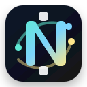

<p align="center">
  
</p>

<h1 align="center">Nexora</h1>

<p align="center"><a href="README.md">English</a></p>

<p align="center"><strong>面向持久化、可审查自动化的本地优先 Agent OS 控制平面。</strong></p>

<p align="center">通过 Mission Control、类型化 API、持久事实、审查门、回执、检查点、技能、记忆和描述符式集成来协调多智能体工作。</p>

Nexora 始终让运行边界保持可见。命令只记录控制平面事实；外部执行保持禁用，直到后续阶段加入明确的适配器、同意流程、沙箱、策略门、回执和验证证据。

## 快速开始

```bash
nvm use
pnpm install --frozen-lockfile
pnpm lint
pnpm typecheck
pnpm test --run --reporter=dot --silent
pnpm --filter @nexora/mission-control build
```

- **本地运行：** 在不同终端分别执行 `pnpm dev:api`、`pnpm dev:worker` 和 `pnpm dev:web`。
- **控制界面：** Web 服务启动后，Mission Control 可通过 `http://127.0.0.1:4311/` 打开。
- **数据模型：** 本地数据库保存描述符、事件、回执、检查点、调度和投影。
- **默认边界：** 允许记录描述符式控制事实；默认拒绝真实外部执行。

## 当前状态

- 最新完成阶段：C25 Studio / Media / Avatar 控制平面。
- 最新阶段提交：`0a3df795210f4b1520036f85b2a1df55adbc5335`（`feat: add studio media control plane`）。
- 当前准备度：下一阶段是 C26 多智能体团队协作和附件描述符。
- 运行边界：除非后续阶段明确启用真实适配器，否则保持本地控制平面和描述符式运行。
- 验证证据：focused、unit、integration、e2e、Mission Control build、视觉 QA、ADR、runbook 和进度日志位于 `artifacts/progress/` 与 `docs/`。

## 现有能力

Nexora 当前提供经过验证的本地控制平面：

| 领域 | 覆盖内容 | 边界 |
|---|---|---|
| Runtime registry | Runtime、provider、model、backend、tool 和 protocol catalog 描述符 | 不执行真实 provider 或外部工具 |
| Gateway | Gateway、channel、session、cursor checkpoint、message idempotency、delivery receipt、allowlist | 不连接真实消息、Web 或 API provider |
| Goal Mode | continuation、auxiliary Judge JSON、max turns、subgoal、pause/resume、deadline 与 budget 控制 | 不调用真实外部 Judge provider |
| Skills/Learning | skill 描述符、版本、approved snapshot、quarantine、learning candidate、`/learn` | 不安装外部 skill，不执行外部工具 |
| Journal | vault bridge 描述符、source snapshot、graph/FTS snapshot、memory candidate、writeback review facts | 不对真实外部 vault、wearable 或 protocol 写回 |
| Browser/Computer | browser/computer session 描述符、sandbox policy、target allowlist、approval、action 和 screenshot receipt | 不执行真实浏览器或桌面自动化 |
| Voice/Jarvis | audio policy、wake word、voice session、transcript lifecycle、wall-mode command | 不读取麦克风、不播放扬声器音频、不调用语音 provider |
| Studio/Media | media artifact、render job、source/generation 描述符、avatar consent、share 和 command facts | 不调用 media/avatar provider，不拉取 URL/PDF/cloud file，不渲染或发布 |

## 安装

使用 Node.js 22 和 pnpm 10.10.0。本仓库保持本地优先，不需要外部数据库、队列、provider 账户、遥测采集器或 SaaS 凭据。

```bash
nvm use
pnpm install --frozen-lockfile
cp .env.example .env
```

最小环境变量：

```bash
NEXORA_DATA_DIR=./.nexora/data
NEXORA_API_HOST=127.0.0.1
NEXORA_API_PORT=4310
NEXORA_LOG_LEVEL=info
NEXORA_AUTH_MODE=local
NEXORA_DB_PATH=./.nexora/data/nexora.sqlite
NEXORA_MIGRATION_MODE=auto
```

## 验证

Nexora 目前还没有单一的 `doctor` 命令。使用以下验证循环作为项目健康检查：

```bash
pnpm lint
pnpm typecheck
pnpm test --run --reporter=dot --silent
pnpm test:integration
pnpm test:e2e
pnpm --filter @nexora/mission-control build
```

常用 focused 检查：

```bash
pnpm exec vitest run packages/contracts/src/studio-media.test.ts packages/persistence/src/c25-studio-media.test.ts apps/api/src/routes/studio-media.test.ts apps/cli/src/studio-media.test.ts apps/mission-control/src/pages/studio-media.test.tsx apps/mission-control/src/app/router.test.tsx --reporter=dot
pnpm exec vitest run apps/api/src/routes/gateway.test.ts apps/api/src/routes/goal-mode.test.ts apps/api/src/routes/skills-learning.test.ts --reporter=dot
```

如果桌面环境的 Node 版本高于项目范围，可能出现 engine warning。项目目标是 `>=22.13.0 <23.0.0`；记录 warning 即可，不应为了掩盖问题修改 engine 约束。

## 本地运行

在不同终端启动服务：

```bash
pnpm dev:api       # http://127.0.0.1:4310
pnpm dev:worker    # local orchestration worker
pnpm dev:web       # http://127.0.0.1:4311
```

写入确定性的本地 workspace graph：

```bash
NEXORA_DATA_DIR=/tmp/nexora-local/data pnpm tsx tests/fixtures/seed-workspace.ts --data-dir /tmp/nexora-local/data
```

用命名卷中的 SQLite 运行接近发布形态的本地 loopback 栈：

```bash
docker compose config
docker compose build
docker compose up -d
curl -fsS http://127.0.0.1:4310/v1/health
curl -fsS -I http://127.0.0.1:4311/
docker compose down
```

Compose 栈只在本地运行：API 和 Web 绑定 loopback，SQLite 保持本地，不启动 provider、connector、外部数据库、队列或遥测后端。

## 命令和 API 表面

HTTP 命令在记录控制事实后返回 `202 Accepted`。这不代表外部业务动作已经完成。完成、审查和恢复需要通过持久化描述符、事件、回执和投影观察。

常用 API 表面：

| 表面 | 示例 |
|---|---|
| Health | `GET /v1/health` |
| Registry | `GET /v1/registry?workspace_id=...` |
| Gateway | `GET /v1/gateway?workspace_id=...` |
| Goal Mode | `GET /v1/goal-loops?workspace_id=...` |
| Skills/Learning | `GET /v1/skills?workspace_id=...` |
| Journal | `GET /v1/journal?workspace_id=...` |
| Browser/Computer | `GET /v1/browser-computer?workspace_id=...` |
| Voice/Jarvis | `GET /v1/voice-sessions?workspace_id=...` |
| Studio/Media | `GET /v1/studio?workspace_id=...` |

写操作需要 Owner workspace 权限和 `Idempotency-Key`。版本化更新和 operator command 需要 `If-Match`。读操作需要 `run:read`。错误响应使用稳定的已脱敏契约，绝不回显 secret、token、被拒绝的原始值或内部文件路径。

## Mission Control

Mission Control 是本地 Web 控制界面。当前页面包括：

- Inbox、goals、tickets、runs、reviews、artifacts、memory、workflows 和 design system。
- Registry、Gateway、Goal Mode、Skills/Learning、Journal、Browser/Computer、Voice/Jarvis 和 Studio/Media。
- 桌面与移动端响应式布局，并保留当前 QA 门使用的五项移动底部导航。

代表性本地 URL：

```text
http://127.0.0.1:4311/
http://127.0.0.1:4311/registry?workspace=ws-demo
http://127.0.0.1:4311/gateway?workspace=ws-demo
http://127.0.0.1:4311/studio-media?workspace=ws-demo
```

部分阶段视觉 QA 脚本使用端口 `4313`，用于把浏览器测试与常规开发服务隔离。

## 安全模型

Nexora 围绕保守的控制平面保证构建：

- 严格 wire contracts 拒绝未知字段和无效版本。
- SQLite migrations 强制 workspace/run scope、foreign keys、payload/column parity、append-only facts 和受保护的状态转换。
- Idempotency keys 绑定稳定的客户端语义；变更后的 replay 会被拒绝。
- `If-Match` 乐观并发避免过期 operator command 静默覆盖新状态。
- Descriptor references 拒绝 `secret://`、原始本地路径、不安全 HTTP(S)、路径穿越、反斜杠、编码后的 secret/path 标记、default-ignorable 字符和 credential-shaped text。
- 外部执行默认拒绝，直到后续阶段加入显式适配器、同意、沙箱、策略、回执和验证门。

## 仓库结构

```text
apps/api/              Control API, auth, command routes, local bootstrap
apps/cli/              Parser for descriptor-only control commands
apps/mission-control/  Mission Control web UI
apps/worker/           Local orchestration worker entrypoint
packages/contracts/    Versioned wire contracts
packages/persistence/  SQLite migrations, schema, repositories, rollback checks
packages/policy/       Workspace scope and authorization decisions
packages/orchestration/ Durable queue, schedules, leases, recovery
packages/runtime-adapters/ Deterministic, local, and remote adapter contracts
packages/memory/       Markdown-backed memory and receipts
packages/artifacts/    Artifact metadata and persistence helpers
packages/connectors/   Connector contracts and policy-safe descriptors
tests/                 Integration, e2e, fixtures, and recovery drills
docs/adr/              Architecture decision records
docs/runbooks/         Operator runbooks and incident/recovery procedures
artifacts/progress/    Stage evidence, verification logs, screenshots, handoffs
```

## 架构

Nexora 是 TypeScript monorepo。Mission Control 调用 Control API。API 将严格描述符记录和命令事实写入本地数据库。Domain packages 定义 contracts、policy、persistence、orchestration、runtime adapter boundaries、memory、artifacts 和 connector descriptors。

设计偏向持久事实，而不是隐式进程内存：

- SQLite 是 run state、descriptors、events、schedules、receipts 和 projections 的事实源。
- Markdown vault files 用于摘要需要人类可读的 memory 和 operational artifacts。
- Append-only facts 支撑 reviews、delivery receipts、browser/computer actions、voice commands、render jobs、generation descriptors、shares 和 Studio commands。
- Recovery 基于 checkpoints、leases、persisted cursors、idempotency records 和显式 runbooks。

## 文档

从这里开始查看操作和设计细节：

- [Development runbook](docs/runbooks/development.md)
- [Release runbook](docs/runbooks/release.md)
- [Backup and restore](docs/runbooks/backup-restore.md)
- [Registry operations](docs/runbooks/registry-operations.md)
- [Gateway operations](docs/runbooks/gateway-operations.md)
- [Goal Mode operations](docs/runbooks/goal-mode-operations.md)
- [Skills/Learning operations](docs/runbooks/skills-learning-operations.md)
- [Journal operations](docs/runbooks/journal-operations.md)
- [Browser/Computer operations](docs/runbooks/browser-computer-operations.md)
- [Voice/Jarvis operations](docs/runbooks/voice-jarvis-operations.md)
- [Studio/Media operations](docs/runbooks/studio-media-operations.md)

架构决策位于 [docs/adr](docs/adr)。当前进度台账是 [tasks/agent-os-progress.md](tasks/agent-os-progress.md)。

## 路线图

下一批计划阶段：

| 阶段 | 范围 | 边界 |
|---|---|---|
| C26 | 多智能体团队描述符、附件、并行 attempt、dependencies、merge/review facts | 仅控制平面 |
| C27 | 面向企业系统、搜索、发布、富集、workspace 和客户触达表面的业务 connector descriptors | 默认 draft/review；真实授权和副作用需要显式批准 |
| C28 | 私有/移动部署、backup/restore、安全网络、移动审批、remote revoke | 真实运行前需要部署和远程安全门 |

## License

Private repository. Add a license file before distributing outside the project owner boundary.
