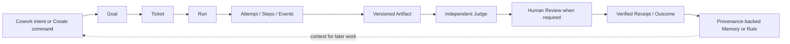
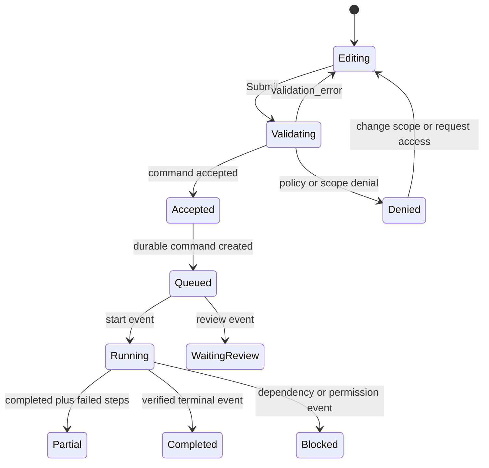

# Nexora Agent OS Frontend UI Design

> Status: implementation-ready product/UI specification. This document is the visual and interaction input for C10-C16; [DESIGN.md](../DESIGN.md) is the token and primitive contract.
>
> Scope: a local-first, auditable web Mission Control. This is a design proposal, not a statement that the described UI or backend capabilities already exist.

## 1. Decision Summary

Nexora merges two complementary layers rather than combining two products indiscriminately:

- **Agent OS inspiration:** one Mission Control, a shared memory, agents and model routing, Goal/Kanban work, reusable loops, and visible artifacts.
- **AionUI interaction inspiration:** a low-friction workspace-bound conversation, Agent/Model/MCP/Skill selection, Team coordination, multi-format preview, Cron entrypoints, and concise runtime confirmations.
- **Nexora's non-negotiable control plane:** Goal/Ticket/Run/Attempt/Step/Event as durable facts; scope isolation; R0-R3 policy; payload-hash approval; Judge and human Reviewer separation; receipts; idempotency; egress disclosure; recovery.

The resulting product has **two speeds and one truth**:

1. **Quick Cowork** makes it easy to describe work and observe progress in a familiar workspace conversation.
2. **Mission Control** makes the same work accountable, searchable, recoverable, and safe to approve.
3. Conversation is never the source of truth for execution. Every meaningful turn points to a Run and its evidence chain.

The visual language is a dense graphite control surface with one restrained teal action color. It intentionally avoids an AI-purple marketing treatment, a generic chat-first layout, and decorative dashboard cards.

## 2. Evidence Boundary And Source Translation

### 2.1 Evidence Boundary

The direct YouTube page for [`qMvkdMzuYjs`](https://www.youtube.com/watch?v=qMvkdMzuYjs) was not readable in this environment. The local source map confirms only its identity as a Julian Goldie Hermes Agent OS course; it does not establish a transcript, timestamps, UI frames, or course-specific implementation claims. The design therefore uses accessible Agent OS/Hermes themes as inspiration and treats all product mechanics below as Nexora design decisions.

The existing source boundary in [agent-os-design.md](agent-os-design.md) remains controlling: marketing claims such as "free," "infinite," "10X," or "24/7" are not performance, security, availability, or cost commitments.

### 2.2 Source-To-Design Matrix

| Source pattern | Evidence classification | Nexora UI decision | Safety refinement |
|---|---|---|---|
| One-screen Agent OS / Mission Control | Agent OS theme documented in [agent-os-design.md](agent-os-design.md) | Mission Control answers "what needs a human, what is running, what is next" in one screen. | It does not imply a single unbounded dashboard or a claim that every system state is live. |
| Shared brain / memory | Agent OS theme; documented Nexora Memory Vault | Every work surface can open memory provenance, trust, scope, and usage. | Conversation history is not silently promoted into reusable memory. |
| Model chips / replaceable runtimes | Agent OS theme and AionUI runtime selection | Cowork exposes understandable policy choices; Registry exposes detailed provider configuration. | Run Detail always records the selected policy, resolved model, runtime, location, and egress result. |
| Workspace-bound Cowork | AionUI repository evidence synthesized in [comparison](aionui-analysis-and-agent-os-comparison.md) | Composer binds the intent to workspace, Agent, model policy, MCP/connector set, and skills snapshot. | The UI submits a command; control-plane policy re-evaluates scope and risk server-side. |
| Team leader, slots, mailbox, task board | AionUI Team experience | Team Cockpit shows owner, slot status, task handoffs, and shared/isolated workspace mode. | Each slot maps to child Ticket/Run and receives its own policy decision; a leader never inherits all permissions. |
| Multi-format Preview | AionUI Preview experience | Artifact Workspace offers Preview, Diff, Source, and Receipt rather than a message attachment list. | Preview is a fixed artifact version, supports size/renderer limits, and records edit conflicts. |
| Cron from a conversation | AionUI Cron experience | Cowork can propose a schedule after a successful run; Workflows/Schedules holds the durable definition. | Every fire creates `ScheduleOccurrence -> Run`, never a blind message replay. |
| Runtime confirmation | AionUI permission UX | R0/R1 may use a concise confirmation sheet close to the work. | R2/R3 go to Review Center with exact scope, evidence, payload hash, expiry, and reviewer identity. "Always allow" can never widen scope or bypass R3. |
| Define done -> act -> judge -> revise | Agent OS loop theme | Goal and Workflow views make Definition of Done, quality gates, Judge state, and revise loop visible. | Judge result is not human approval and cannot authorize a public, financial, or irreversible side effect. |

## 3. Product Mental Model

### 3.1 Evidence Spine

Every main UI path must preserve the following relationship. The links are deep-linkable, and every downstream screen links back to the upstream scope and inputs.



The interface must never compress this chain into a generic message status. A Quick Cowork message may summarize the path, but all statuses and side effects come from the projected durable objects.

### 3.2 Roles And Decision Rights

| Role | Home question | Primary rights | Explicit restriction |
|---|---|---|---|
| Owner | Is this workspace governed and healthy? | Configure workspace, policy, registry, budget, and Owner-only recovery. | Cannot erase immutable audit facts. |
| Operator | What needs intervention and what can I safely run? | Create Goal/Ticket, start, pause, resume, retry allowed work. | Cannot approve external R3 effects. |
| Reviewer | What exactly will change and why is it safe? | Approve, reject, request changes within authorized scope. | Cannot approve a stale or hash-mismatched payload. |
| Viewer | What happened and what does it mean? | Read permitted projections, artifacts, receipts, and audit views. | Never sees a hidden command as if it were executable. |
| Agent | What scope, tools, and output are assigned? | Execute its authorized Run and write evidence. | Never has human approval authority. |

When a user lacks rights, the UI says the required role, affected scope, and a safe next action. It does not merely hide the control or return an unexplained 403.

### 3.3 Information Hierarchy

The hierarchy is visible in every route:

```text
Workspace > Site or Project > Goal > Ticket > Run > Artifact or Receipt
```

- **Workspace** is the data/policy boundary.
- **Goal** answers why the work matters and what "done" means.
- **Ticket** is the executable unit of human or agent work.
- **Run** owns observation and recovery.
- **Artifact** owns versioned output.
- **Receipt** owns verified evidence of an outcome.

## 4. Information Architecture And Navigation

### 4.1 Desktop Navigation

The desktop sidebar groups surfaces by user intent, not backend implementation detail.

| Group | Routes | Purpose |
|---|---|---|
| Workbench | Mission Control, Inbox, Activity, Review | Triage and decisions |
| Work | Cowork, Goals, Tickets, Runs, Artifacts, Memory | Create, observe, and reuse work |
| Build | Teams, Workflows, Schedules | Coordinate repeatable work |
| System | Registry, Control Room, Settings | Configure and operate the platform |

The sidebar has a persistent scope switcher and compact connection state. The top bar has global search, a command palette trigger, a single `Create` command, unread attention/review counts, and the account menu. `Create` opens a menu with New Goal, New Ticket, Attach Artifact, Start Cowork Run, and, when permitted, New Workflow or Schedule.

### 4.2 Mobile Navigation

Mobile has exactly five labelled destinations:

| Item | Content | Badge |
|---|---|---|
| Inbox | Human attention, mentions, permission requests | unresolved count |
| Runs | Active, paused, blocked, and recently completed runs | active count |
| Goals | Goal progress and blockers | blocked count |
| Review | Approval queue and decisions | actionable count |
| More | Cowork, artifacts, memory, teams, workflows, registry, settings | none |

The persistent mobile primary action is `Start` in the top bar, opening Quick Cowork. Complex graph authoring, broad registry edits, and full-width diffs are intentionally desktop-first. The app provides a deep link and a "Continue on desktop" action rather than mimicking a broken three-column layout on a phone.

### 4.3 Route Contract

| Route | Primary surface | Required URL state |
|---|---|---|
| `/mission-control` | Mission Control | `workspace`, `site`, `project`, filters |
| `/cowork/:conversationId?` | Quick Cowork | scope, optional `run`, optional draft |
| `/inbox` | Inbox | scope, type, assignee, cursor |
| `/goals` and `/goals/:goalId` | Goal portfolio/detail | scope, status, view |
| `/tickets` and `/tickets/:ticketId` | Tickets and Kanban/detail | scope, goal, status, filter |
| `/runs/:runId` | Run Detail | attempt, event cursor, selected step |
| `/teams` and `/teams/:teamId` | Team Cockpit | scope, run, view |
| `/review` and `/review/:reviewId` | Review Center | queue filter, selected evidence tab |
| `/artifacts` and `/artifacts/:artifactId` | Artifact Workspace | version, tab |
| `/memory` and `/memory/:memoryId` | Memory Explorer | scope, type, trust, version |
| `/workflows/:workflowId?` and `/schedules/:scheduleId?` | Workflow and Schedule | scope, version, occurrence |
| `/registry/:kind?` and `/control-room` | Registry and Control Room | kind, health filter |
| `/settings/:section?` | Settings | section |

All list filters, selected tab, cursor, and scope are represented in the URL. Browser Back restores the same view state and never repeats a command.

## 5. App Shell And Responsive Rules

### 5.1 Desktop Frame

```text
┌──────────────────────────────────────────────────────────────────────────┐
│ Scope switcher / crumb         Search    Create    sync / account          │
├──────────────┬──────────────────────────────────────────┬─────────────────┤
│ Navigation   │ Main work canvas                         │ Context rail    │
│ grouped by   │ One route-level scroll owner             │ Evidence,       │
│ intent       │                                          │ policy, next    │
│              │                                          │ action          │
└──────────────┴──────────────────────────────────────────┴─────────────────┘
```

- The contextual rail is context-dependent, not a permanent third card column. Mission Control uses it for health/routing/approval. Run Detail uses it for provenance and recovery. It becomes a resizable overlay below 1440px.
- A page has one primary scroll owner. Run Timeline and event inspector can each scroll only when they are independently bounded panes; the document never owns a competing third scroll.
- Tables retain semantic headers. On narrow panes, columns collapse into labelled rows before any horizontal overflow is offered.

### 5.2 Breakpoint Behavior

| Range | Navigation | Content | Inspector | Priority |
|---|---|---|---|---|
| `>=1440px` | full 232px sidebar | 12-column canvas, list-detail allowed | persistent 336px rail | dense scan and side-by-side evidence |
| `1024-1439px` | full 216px sidebar | fluid two-column/intrinsic grid | drawer opened on demand | preserve reading width |
| `768-1023px` | 64px rail plus labelled drawer | one main pane or two compact panes | modal/drawer | keep commands and evidence reachable |
| `<768px` | five-item bottom nav | one pane, cards/lists | sheet or detail route | act on attention, never shrink desktop |

At 375px, the UI may horizontally scroll code, diff, or graph canvases inside a named accessible `reel`; the primary page content itself must not overflow horizontally.

## 6. Shared Interaction Contracts

### 6.1 Command Lifecycle



- A server `202` means **Accepted**, not complete. The UI shows a stable command ID and opens the projected Run/Goal state.
- Mutating controls use an idempotency key and remain disabled while the key is in flight.
- A mutation becomes success only after the relevant projected event confirms the business state. Conflicts preserve unsent form content and show the latest version/decision needed to resolve it.

### 6.2 Live Data And Recovery

- SSE uses `event_id` and cursor/last-event recovery. Reconnecting is visible and never replays or double-counts already applied events.
- Offline mode retains cached read-only data marked with last-sync time. It may locally draft low-risk input but never queues a high-risk approval for later execution.
- `side_effect_unknown` freezes retry and presents a reconciliation path: inspect receipt, query external state, then retry only if the policy records it as safe.

### 6.3 Permission And Approval Ladder

| Risk | UI location | Required evidence | Permitted decision |
|---|---|---|---|
| R0 read | inline activity or source picker | scope and data classification | permitted read / request scope |
| R1 internal write | compact confirmation near the initiating work | target, scope, expected internal write | allow once or cancel |
| R2 controlled external action | Review Center or embedded review drawer | preview, target, egress, reversibility, Judge state | Reviewer approval if policy allows |
| R3 public/financial/irreversible | dedicated Review Center decision sheet | exact payload hash, diff, source receipts, target, egress, cost, expiry, rollback, Judge, reviewer identity | explicit human approve, reject, or changes request |

`Allow once` is bounded to a specific operation and scope. It never becomes a permanent entitlement. `Approve with edits` creates a new artifact/payload version and therefore requires a new hash and a new review decision.

### 6.4 Create And Configure Progression

Quick Cowork starts with an outcome and only exposes advanced settings when required:

1. Choose or confirm workspace.
2. Describe intended outcome; optionally attach artifact/context.
3. Show recommended Agent, model policy, skills, and tools as editable chips with a short reason.
4. Show only risk-relevant configuration: local/remote execution, affected connector, or budget cap.
5. Submit a command that creates a traceable Goal/Ticket/Run relationship.
6. Stream concise stage updates; `Open Run` leads to audit detail, and `Open artifact` leads to a fixed version.

## 7. Core Surfaces

Each surface has a route, a primary question, an owned interaction, observable states, evidence links, and an explicit policy boundary. These are the twelve implementation surfaces.

### 7.1 Mission Control

- **Route and audience:** `/mission-control`; Owner, Operator, Reviewer.
- **Primary question:** What requires a human, what is currently running, and what is the next permitted action?
- **Layout:** top scope/search/create bar; Needs Attention first; Active Runs second; Goals and Recent Artifacts third; right rail for Run Health, model routing, and approval queue. Avoid decorative KPI tiles with no drill-down.
- **Actions:** open attention item, pause a permitted active run, create work, open review queue, filter by scope/status.
- **Evidence:** every count opens a filtered list; every row exposes scope, run/goal ID, timestamp, and next action.
- **States:** skeleton rows; actionable empty state; stale health with last-sync; per-module error retry; permission-filtered values with explanation; partial health shows healthy modules alongside failed modules.
- **Guard:** no global "run everything" action. Pause/stop confirms side-effect implications.

### 7.2 Quick Cowork

- **Route and audience:** `/cowork/:conversationId?`; Operator and permitted Viewer/Reviewer read access.
- **Primary question:** Can I ask for useful work without first learning the control-plane vocabulary?
- **Layout:** conversation/workspace timeline in the center; compact configuration bar above composer; artifact preview drawer; context drawer for selected memory, Agent/model policy, tools, and Run link.
- **Actions:** start a run, attach context, choose workspace/agent/policy, respond to R0/R1 confirmation, fork a follow-up from a versioned artifact.
- **Evidence:** every assistant status resolves to a Run/Attempt; tool action resolves to event/receipt; artifact chip shows exact version and validation state.
- **States:** draft saved locally, queued, running, waiting review, blocked, partial, failed, completed; empty first-run suggests a Goal or workspace.
- **Guard:** no free-form runtime confirmation can override scope policy. A Cowork message does not imply success until the Run projection confirms it.

### 7.3 Inbox

- **Route and audience:** `/inbox`; all human roles according to visibility.
- **Primary question:** What needs my attention before it becomes stale, blocked, or unsafe?
- **Layout:** list-detail pattern. Tabs: Attention, Mentions, Approvals, Failures, Handoffs. List rows use severity, scope, age, owner, and next safe action; detail shows selected evidence.
- **Actions:** acknowledge, open Run/Review, claim a handoff, assign, mute non-critical notification, request access.
- **Evidence:** item type points to the original Goal/Ticket/Run/Review; timeline preserves why the item exists.
- **States:** zero-inbox empty state differs from no-access; offline reads cache but disables ack/assignment; partial success splits completed and failed actions.
- **Guard:** acknowledgement cannot resolve a required Review or erase evidence.

### 7.4 Goal Portfolio And Goal Detail

- **Route and audience:** `/goals`, `/goals/:goalId`; Owner, Operator, Reviewer, Viewer.
- **Primary question:** Are we progressing toward a verifiable outcome, and what is blocking it?
- **Layout:** portfolio filters and goal list; detail has immutable goal summary, Definition of Done, milestones, progress, budget, next executable Ticket, evidence feed, and linked artifacts/reviews.
- **Actions:** create/clarify Goal, add milestone, create Ticket, pause goal, change non-executed priority, request review for goal-level decision.
- **Evidence:** Definition of Done has source/version; progress is derived from Ticket/Run state, not manually painted; budget links to cost events.
- **States:** no goals, no executable ticket, blocked dependency, paused, partial success, overdue deadline.
- **Guard:** changing a goal does not silently rewrite already-started Ticket/Run inputs; it creates a revision and exposes impact.

### 7.5 Tickets And Kanban

- **Route and audience:** `/tickets`, `/tickets/:ticketId`; Owner and Operator, Reviewer/Viewer read per policy.
- **Primary question:** What executable work exists, what depends on what, and what may move next?
- **Layout:** list and board views. Board lanes are `Backlog`, `Ready`, `Running`, `Review`, `Done`; exception filters expose `Blocked`, `Paused`, `Failed`, and `Cancelled`. Detail has requirements, scope, dependencies, run history, artifacts, and next action.
- **Actions:** create/assign Ticket, move through an explicit status menu, view dependencies, start Agent from Ready, open child Runs.
- **Evidence:** card shows owner, scope/risk, progress, blocking reason, latest artifact, and status timestamp; details show revisions and events.
- **States:** lane skeleton, empty lane, blocked/dependency, failed/retryable, offline read-only board, permission-filtered actions.
- **Guard:** drag is optional and never starts an Agent without a dedicated confirmation. Keyboard status menu offers the same changes.

### 7.6 Run Detail

- **Route and audience:** `/runs/:runId`; any authorized reader, with mutation rights determined separately.
- **Primary question:** Why did this run, what has happened, where is it blocked, and can it be recovered safely?
- **Layout:** header with current state, trigger, Ticket, current Attempt, runtime/location, budget and actions; chronological timeline centre; context/evidence inspector right rail; attempt selector and artifacts/receipts below.
- **Actions:** pause, resume, stop, retry failed step, change model/connector to make a new attempt, open artifact/receipt, send to review, reconcile unknown side effect.
- **Evidence:** event timeline is ordered and links each tool call to inputs/outputs; state shows runtime, resolved model, tools, cost, duration, location/egress, lease/fencing status when relevant.
- **States:** not started, queued, running, paused, waiting review, blocked, partial, failed, succeeded, cancelled, side-effect unknown, reconnecting event stream.
- **Guard:** Stop explains known/unknown side effects. Retry targets failed steps only and cannot replay a successful side effect. Model/connector changes preserve the prior attempt.

### 7.7 Team Cockpit

- **Route and audience:** `/teams`, `/teams/:teamId`; Owner/Operator, Reviewer/Viewer per scope.
- **Primary question:** Which agent owns each piece of work, what is waiting, and how does the team converge?
- **Layout:** Team summary with objective, workspace mode, Leader state, slots and child-Runs; secondary tabs for Task Board, Mailbox, Activity, and Handoffs. Wide view permits parallel slot columns; compact view switches to one selected slot plus aggregate status.
- **Actions:** create team from approved template, add/remove permitted slot, assign child Ticket, send handoff, pause/cancel permitted child run, open conflict/diff for shared workspace edits.
- **Evidence:** stable slot ID, agent profile/version, workspace mode (shared or isolated), scope/risk, child Ticket/Run, mailbox delivery/ack, and join/leave audit events.
- **States:** leader warm-up, queued, running, paused, blocked, cancelled, partial team success, teammate failure isolated from other work, conflict requiring human merge.
- **Guard:** Leader is a coordination role, not a permission escalation. Shared workspace requires version/diff/merge path; isolated workspace requires an explicit merge step.

### 7.8 Review Center

- **Route and audience:** `/review`, `/review/:reviewId`; Reviewer and Owner, read-only preview for others where policy permits.
- **Primary question:** What exact action is requested, what evidence supports it, and is it still safe to authorize?
- **Layout:** queue list on left, decision canvas centre, immutable evidence inspector right. Centre stacks risk/scope/target summary, diff, source receipts, Judge result, cost/egress, reversibility, exact payload hash, decision reason, and action bar.
- **Actions:** approve, reject, request changes, approve with edits where enabled, pause related workflow, compare changed payload/version.
- **Evidence:** reviewer identity, timestamp, decision reason, policy version, scope, risk, artifact/review version, hash, external receipt, rollback action.
- **States:** evidence loading/error, no approval, missing source, Judge fail/uncertain, stale review, hash mismatch, insufficient role, offline disabled action, execution/verification in progress, verified receipt.
- **Guard:** an R3 action requires an exact current hash. The sheet disables decision controls if evidence is incomplete, policy changed, the review expired, the user is offline, or a new artifact version exists.

### 7.9 Artifact Workspace

- **Route and audience:** `/artifacts`, `/artifacts/:artifactId`; all human roles subject to visibility and scope.
- **Primary question:** What was produced, from exactly which inputs, is it verified, and may it be published or changed?
- **Layout:** list filters by state/source/risk; detail header contains artifact type, version, status, visibility, agent/model, source Ticket/Run, and linked Review. Four persistent tabs: Preview, Diff, Source, Receipt.
- **Actions:** open fixed version, compare versions, create edit/fork, send verified draft to review, export an approved version, request a re-run.
- **Evidence:** source Run/Step/Agent/Skill, memory reads, input summary, validation/Judge, review decision, receipt, public/private visibility, creation/update time, hash.
- **States:** render skeleton, unsupported/too large view, redacted content, preview failure with download/log option, no version, stale editor conflict, missing source, superseded artifact.
- **Guard:** Preview is sandboxed and never implies permission to publish. Edits create a new version; publish/export that has external impact follows the review ladder.

### 7.10 Memory Explorer

- **Route and audience:** `/memory`, `/memory/:memoryId`; all roles read according to scope; editing is policy gated.
- **Primary question:** What does the system know, where did it come from, who used it, and can it be trusted or rolled back?
- **Layout:** scoped tree/list on left, memory reading surface centre, provenance/impact/version rail on right. Facets include Global/Site/Project/Ticket scope, Fact/Preference/Rule/Receipt/Draft/Unverified type, trust, source, and last use.
- **Actions:** inspect provenance, compare versions, request scope, mark stale, propose memory update, resolve conflict, rollback authorized snapshot.
- **Evidence:** source file/Run/Artifact/receipt, creator Agent, trust state, timestamp, consumers, conflict set, redaction and scope decision.
- **States:** empty scope, indexed but stale, parse/source error, denied scope, conflict, unverified, partially indexed, redacted field.
- **Guard:** no secret appears in source preview, prompt, logs, or screenshot. A denied cross-scope read tells the user why and offers an authorized request path rather than exposing resource existence.

### 7.11 Workflow And Schedule Studio

- **Route and audience:** `/workflows/:workflowId?`, `/schedules/:scheduleId?`; Owner/Operator, Reviewer read and approval according to policy.
- **Primary question:** How will a repeatable process progress, what can fail, and when does it run?
- **Layout:** workflow template list plus version/detail. Detail uses a graph or ordered station list, a node inspector, run history, quality gates, review gates, and schedule panel. On mobile, graph editing is not offered; show station list and occurrence status.
- **Actions:** create from template, inspect workflow version, configure inputs/outputs/quality/retry, create or pause Schedule, run now if policy permits, inspect occurrence and its Run.
- **Evidence:** each station has inputs, assigned Agent/model policy, outputs, quality gate, review gate, retry policy, version, and linked Run/receipt. Each schedule shows timezone, next/last fire, overlap/misfire policy, occurrence ID, and dedupe result.
- **States:** draft, published workflow version, waiting dependency, disabled schedule, missed/ambiguous occurrence, overlap blocked, failed step, review waiting, occurrence reconciled.
- **Guard:** an edge is data/control flow, not a guarantee of synchronous completion. Schedules create durable occurrences and never replay an old conversation verbatim.

### 7.12 Registry And Control Room

- **Route and audience:** `/registry/:kind?`, `/control-room`; Registry needs Owner configuration rights, while Control Room has authorized read access.
- **Primary question:** What capabilities are available, healthy, policy-compatible, and safe to route work toward?
- **Layout:** Registry tabs for Agents, Models, Connectors/MCP, Skills, Extensions; Control Room for gateway health, adapter sessions, queue/event lag, schedule/loop health, cost/budget signals, egress summary, and quarantines. Details open an inspector, not nested cards.
- **Actions:** inspect or register approved manifest, test low-risk health connection, disable/quarantine, select default model policy, inspect provider/connector scope and data classification, open affected Runs.
- **Evidence:** manifest/version/signature where applicable, capability tags, health status/time, policy decision, credential reference only (never secret), egress/provider/region, test receipt, quarantine reason and Owner release audit.
- **States:** unavailable, degraded, auth expired, scope denied, connector timeout, provider rate limited, quarantined, remote disconnected, stale health.
- **Guard:** Registry does not execute arbitrary shell/HTTP/file commands. Remote/local execution remains explicit; network loss never silently moves a Run to remote.

## 8. Cross-Surface Workflows

### 8.1 Operator: Goal To Auditable Output

1. Operator starts in Mission Control or Quick Cowork and creates a Goal with a Definition of Done.
2. Goal detail creates Ticket(s) with workspace, scope, dependencies, budget, and suggested Agent policy.
3. The Start action submits an idempotent command; UI shows Accepted then follows the Run's durable events.
4. Run Detail shows plan, events, tool outcomes, artifacts, and recovery state without converting logs into an untraceable summary.
5. Artifact Workspace opens the fixed draft version, source evidence, Judge result, and receipt.
6. When policy requires it, the artifact enters Review instead of publishing. The operator can continue non-dependent work while it waits.

### 8.2 Reviewer: Exact Approval

1. Inbox informs the Reviewer of a decision needed; Review Center opens the exact item via deep link.
2. Reviewer reads summary, diff, source receipts, Judge result, cost, target, scope, egress, reversibility, and payload hash.
3. The decision sheet checks role, policy, expiry, hash, connectivity, and evidence completeness before enabling approval.
4. Approval creates an audit event, then UI shows `executing` and finally a verified external receipt or a reconciliation state; it never claims external success at approval time.
5. Reject and Request Changes return structured reasons to the originating Ticket/Run. Approve With Edits creates a new version and returns to review.

### 8.3 Team: Delegation Without Losing Accountability

1. Operator creates a Team from a template and chooses shared or isolated workspace mode.
2. Leader proposes child Tickets; control plane resolves each slot's scope, Agent, model policy, and tool allowance independently.
3. Cockpit displays the board, mailbox, slot health, blocked reasons, and child Run evidence.
4. Team outputs converge as versioned artifacts; a shared-workspace conflict goes to diff/merge rather than last-writer-wins.
5. Final artifact follows Judge and Review policy; the Team summary links to every child receipt.

### 8.4 Schedule: Cowork To Durable Occurrence

1. After a successful Cowork or Workflow run, user chooses `Schedule` and sees prefilled scope, workflow version, model policy, and workspace.
2. Schedule Studio requires timezone, trigger, overlap policy, misfire policy, and risk-appropriate review behavior.
3. At runtime, an occurrence creates its own Run and follows normal evidence, budget, egress, and approval rules.
4. A missed, duplicated, or blocked occurrence is visible as such and never represented as a generic conversation reply.

## 9. State And Error Model

### 9.1 Read And Write State Contract

| Concern | States | UI rule |
|---|---|---|
| Query | loading, ready, empty, error, offline, permission-filtered | Show a shaped skeleton only while fetching; give every terminal state a factual explanation and next action. |
| Command | editing, validating, submitting, accepted, success, validation error, conflict, permission denied, offline draft | `accepted` is distinct from `success`; preserve user input on recoverable failure. |
| Run | queued, running, paused, waiting review, blocked, partial, failed, succeeded, cancelled, unknown effect | Show current phase plus recovery affordance; retain history rather than replacing it. |
| Review | pending, evidence incomplete, stale, approved, rejected, changes requested, executing, verified, reconcile | An action is enabled only for the current policy/hash/evidence state. |
| Sync | connected, reconnecting, stale cache, offline | Include last known cursor/time and an explicit reconnect result. |

### 9.2 Required Copy Shape

All state planes contain three parts:

1. **What happened:** factual condition, for example `Connector authentication expired`.
2. **Impact:** what cannot proceed, for example `This Run cannot start its publish preview step`.
3. **Next permitted action:** `Reconnect the connector`, `Request an Owner`, `Retry failed step`, or `Open receipt`.

No production UI uses bare error codes, silent blank states, infinite spinners, or a green status based solely on HTTP success.

## 10. Visual And Component Application Rules

### 10.1 Data Density

- Each page may have one primary action. Secondary actions go to a menu, contextual row action, or explicit state plane.
- Cards represent independently actionable work (Run, Goal, Review, Artifact). They do not wrap every section.
- The highest-priority signal appears before charts: attention/review items, blocked work, active execution, then health/cost trend.
- A metric is interactive only when it links to its contributing Runs/Steps/Artifacts/Reviews. Otherwise it is rendered as plain supporting data.

### 10.2 Lists, Tables, And Time

- Use compact rows with a leading semantic icon, title, scope/owner, current state, time, and next safe action.
- List sort defaults are explicit: attention by urgency/age, runs by active state then latest event, reviews by risk/expiry, artifacts by freshness/version.
- Store/display timestamps with timezone context. Time elapsed uses tabular figures and pauses when a Run is not active.

### 10.3 Icons And Tooltips

- Use Lucide as the only icon family. Never use emoji or custom-drawn symbol paths as structural icons.
- Icon-only controls require an `aria-label`, visible tooltip on hover/focus, at least 44px hit area, and an equivalent command-palette action where the action is material.

## 11. Accessibility And Keyboard Behavior

| Surface | Keyboard behavior | Non-pointer alternative |
|---|---|---|
| Global shell | `Tab`/skip link; command palette shortcut announced in help | Search/command button |
| Scope switcher | arrows, Enter, Escape | searchable picker and breadcrumb links |
| Ticket board | arrow/list navigation, status menu, Enter to open | status menu replaces drag |
| Run timeline | chronological landmarks, `End` follows latest event when opted in | new-event button instead of forced scroll |
| Review | tabbed evidence, focus-managed sheet, typed reason focus on failure | all decisions available without hover |
| Artifact preview | tab semantics, accessible download/copy/open-source actions | no canvas-only control |
| Workflow graph | node list and inspector mirror graph order | ordered station list on all breakpoints |

Additional rules:

- Use headings in page-to-panel order and include a route-level `<h1>`.
- Do not use color as the only representation for run state, risk, conflict, or trust.
- Modals/sheets have an Escape route, clear close affordance, focus restoration, and unsaved-change confirmation.
- Live event regions are polite and do not steal focus; urgent policy denials are conveyed as alert content near the blocked action.
- All preference for reduced motion, forced colors, and enlarged text must retain a legible hierarchy.

## 12. Implementation Contract

### 12.1 Required View Models

The frontend does not invent durable status from chat text. C10/C11 queries and event projections need the following view models, all permission-filtered and scope-bound:

| View model | Minimum fields |
|---|---|
| `ScopeContext` | workspace/site/project IDs and labels, access mode, policy version |
| `MissionSummary` | attention items, active runs, goal summary, recent artifacts, health, review count, last cursor |
| `CoworkContext` | conversation ID, workspace, suggested/selected Agent, model policy, skills/MCP snapshot, linked Run IDs |
| `RunView` | IDs, trigger, Ticket, Agent/runtime/model, location/egress, state/phase, attempts, timeline cursor, budget, artifacts, receipts, allowed actions |
| `ReviewView` | risk, scope, payload/review/artifact versions, hash, diff, source receipts, Judge, target, egress, cost, expiry, decision permissions |
| `ArtifactVersionView` | content kind/version/hash, preview limits, source lineage, validation/Judge/Review/receipt, visibility, edit version token |
| `MemoryView` | scope/type/trust/source/consumer/version/conflict/redaction/rollback permission |
| `TeamView` | slots, stable IDs, leader, workspace mode, child Tickets/Runs, mailbox/task/activity, allowed interventions |
| `WorkflowAndScheduleView` | workflow stations/version/gates, schedule definition, occurrence state, timezone, overlap/misfire/dedupe, linked Run |
| `RegistryAndHealthView` | manifest/health/policy/egress/quarantine/credential reference and affected Runs |

### 12.2 Frontend State Ownership

- Server state: TanStack Query-style cache keyed by scope and route parameters; invalidate/reconcile from cursor-ordered events.
- URL state: scope, filters, selected tab, selected object, cursor, and page density mode.
- Local ephemeral state: sheet open state, draft text, local focus return, resize preference, non-authoritative view mode.
- Do not make the client store authoritative Run/Review state or imitate a successful terminal event.

### 12.3 Security Boundaries Exposed In UI

- Client receives redacted projections; rendering must not assume hidden data will arrive and must not reconstruct secrets from identifiers.
- Remote execution, provider, region, data classification, and redaction count are visible where a Run or Review can cause egress.
- Connector/Agent configuration exposes credential references and permission scope, never secret values.
- Browser/web content and user-supplied artifact content are labelled as untrusted. Their text cannot change visible policy or enable a privileged action.

## 13. C10-C16 Delivery Map

This UI specification augments rather than replaces the detailed C00-C16 implementation plan. C10/C11 are the first feature commits; later commits make their corresponding controls real instead of visual placeholders.

| Commit | UI delivery | Definition of readiness |
|---|---|---|
| C10 | App shell, scope switcher, desktop/mobile navigation, command palette, Mission Control, Inbox, shared StatePlane, initial Cowork entry, Design System primitive showcase | Tokens/primitives pass state and viewport QA; routing/deep-link/scope/SSE behavior is real; no blank or color-only status state. |
| C11 | Goal, Ticket/Kanban, Run Detail, Review Center, Artifact Workspace, Memory Explorer | Operator and Reviewer journey reaches a receipt-backed review; keyboard alternatives, conflict/stale/partial states work. |
| C12 | Workflow run surface, Judge and structured handoff in C11/Cowork/Artifact views | SEO draft stops visibly at `waiting_review`; no published or indexed action is represented as complete. |
| C13 | Local/remote selector, egress summary, execution-location and reconciliation views | Local-only remains default; remote runs show minimum snapshot/egress receipt and recovery state. |
| C14 | Schedule Studio and occurrence history | Cron-like entry creates durable occurrence/run; timezone, overlap, misfire, and dedupe states have evidence. |
| C15 | Control Room health, cost, backup/audit, quarantine surfaces | Health and audit information drill into facts; quarantined connector cannot appear normally usable. |
| C16 | Full responsive, visual, accessibility, deep-link, recovery, and offline evidence | All listed surfaces pass E2E/visual/a11y QA; mobile supports triage and permitted action but not unsafe authoring. |

### 13.1 Explicit Deferrals

- C10 must not fake a real Team/Workflow/Registry write flow before the supporting APIs and policy contracts exist. It may route to read-only, unavailable, or feature-gated surfaces with a clear explanation.
- Full Workflow graph editing is deferred until an accessible graph interaction model exists. C12 may ship a read-only graph plus ordered station inspector.
- Mobile does not gain a compressed version of every desktop capability. It prioritizes Inbox, Run intervention, Goal blockers, Review, receipt reading, and safe desktop handoff.

## 14. Visual Reference Assets

The existing assets remain a structural reference, not a final component library. Future implementation must follow [DESIGN.md](../DESIGN.md) if an asset conflicts with the contracted token, responsive, or accessibility rule.

| Surface | Asset |
|---|---|
| Mission Control | [mission-control-overview.png](assets/agent-os-frontend/mission-control-overview.png) |
| Cowork / Agent workspace | [agent-workspace.png](assets/agent-os-frontend/agent-workspace.png) |
| Run Detail | [run-detail.png](assets/agent-os-frontend/run-detail.png) |
| Goals / Kanban | [kanban-goal-mode.png](assets/agent-os-frontend/kanban-goal-mode.png) |
| Memory | [memory-explorer.png](assets/agent-os-frontend/memory-explorer.png) |
| Workflow | [workflow-builder.png](assets/agent-os-frontend/workflow-builder.png) |
| Review | [review-center.png](assets/agent-os-frontend/review-center.png) |
| Artifact | [artifact-workspace.png](assets/agent-os-frontend/artifact-workspace.png) |
| System states | [permission-offline-states.png](assets/agent-os-frontend/permission-offline-states.png) |
| Mobile | [mobile-viewport-390x844.png](assets/agent-os-frontend/mobile-viewport-390x844.png) |

## 15. UI Acceptance Checklist

Before marking the corresponding UI commit complete, verify these observable outcomes:

- [ ] A user can identify attention, active runs, and the next permitted action from Mission Control within one screen.
- [ ] Starting work in Cowork yields an observable accepted/queued/run state rather than a false completion toast.
- [ ] A deep link opens the same scope/filter/tab and does not duplicate a command after refresh or Back navigation.
- [ ] A Run Detail shows the trigger, attempt, timeline, runtime/model, scope, budget, artifact, receipt, and safe recovery action.
- [ ] Kanban movement is possible without drag and never implicitly starts an Agent.
- [ ] A Reviewer can see diff, source, Judge, cost, risk, scope, egress, payload hash, expiry, and exact decision before enabling an R3 approval.
- [ ] A stale or hash-mismatched Review cannot be approved.
- [ ] Artifact Preview/Diff/Source/Receipt refers to a fixed version and edits create a new version.
- [ ] Memory answers source, consumer, trust, scope, conflict, and rollback questions while redacting sensitive data.
- [ ] Offline, permission denied, conflict, error, loading, empty, and partial success all name impact and recovery action.
- [ ] At 390x844, Inbox, Run intervention, Goal blockers, Review, and receipt access remain usable with 44px targets and no primary-content horizontal scroll.
- [ ] Keyboard focus, ARIA semantics, contrast, reduced motion, long labels, empty data, and unbroken IDs pass the C16 accessibility and visual gates.

## 16. References

- [Nexora Agent OS design](agent-os-design.md)
- [AionUI analysis and Agent OS comparison](aionui-analysis-and-agent-os-comparison.md)
- [Agent OS implementation plan](superpowers/plans/2026-08-23-agent-os-implementation.md)
- [Nexora design system contract](../DESIGN.md)
- [Julian Goldie Agent OS video map](/Users/zq/Desktop/ai-projs/posp/agents-contributions/tasks/julian-goldie-agent-os-video-map-2026-08-19.md)

