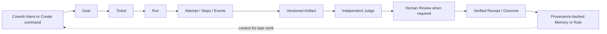
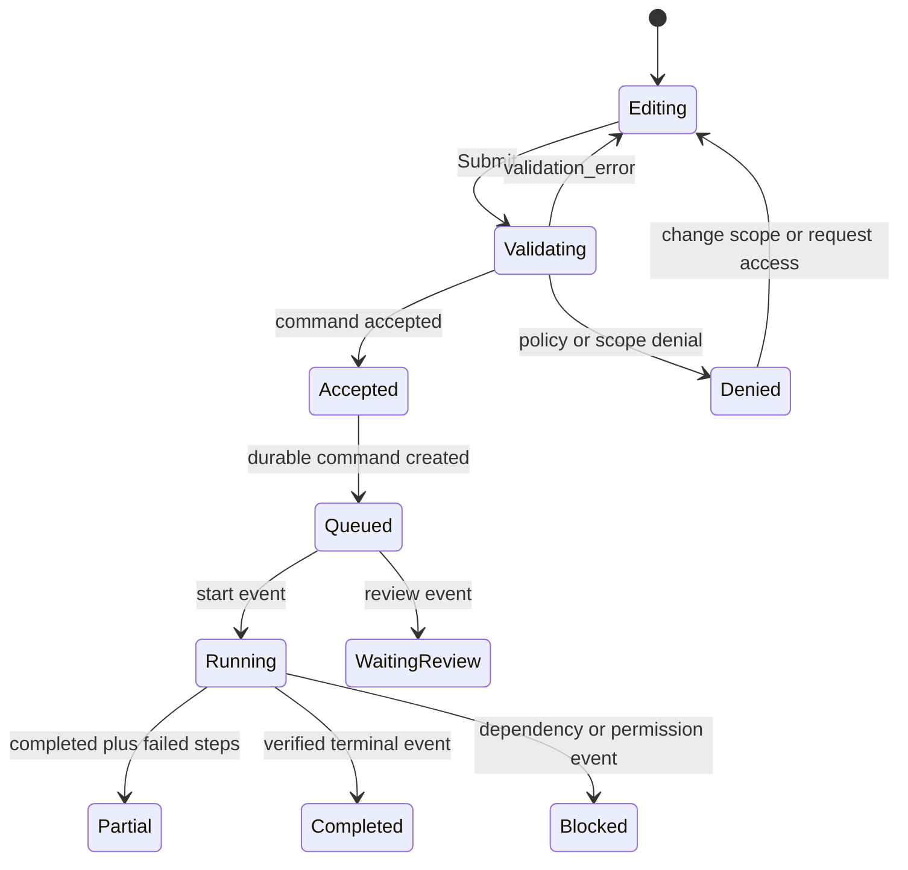

# Nexora Agent OS 前端 UI 设计

> 本文是 [英文原文](nexora-agent-os-ui-design.md) 的完整中文翻译。设计令牌与基础组件契约请参阅 [Nexora 设计系统中文文档](../DESIGN.zh-CN.md)。
>
> 状态：可直接实施的产品/UI 规范。本文档是 C10-C16 的视觉与交互输入；[中文 DESIGN](../DESIGN.zh-CN.md) 是令牌与基础组件契约，英文 [DESIGN.md](../DESIGN.md) 保留为术语对照。
>
> 范围：一个本地优先、可审计的 Web Mission Control。这是一份设计提案，并不表示所述 UI 或后端能力已经存在。

## 1. 决策摘要

Nexora 融合的是两个互补层次，而不是不加区分地拼接两款产品：

- **Agent OS 灵感：** 单一 Mission Control、共享记忆、Agent 与模型路由、Goal/Kanban 工作方式、可复用循环，以及可见的制品。
- **AionUI 交互灵感：** 低摩擦、绑定工作区的对话，Agent/Model/MCP/Skill 选择，Team 协作，多格式预览，Cron 入口，以及简明的运行时确认。
- **Nexora 不可妥协的控制平面：** 以 Goal/Ticket/Run/Attempt/Step/Event 为持久事实；范围隔离；R0-R3 策略；基于载荷哈希的批准；Judge 与人工 Reviewer 分离；回执；幂等性；出站披露；恢复。

最终产品具有**两种速度、一个事实源**：

1. **Quick Cowork** 让用户能在熟悉的工作区对话中轻松描述工作并观察进度。
2. **Mission Control** 让同一项工作可问责、可搜索、可恢复，并能安全地批准。
3. 对话绝不是执行事实源。每一次有实际意义的交互都指向一个 Run 及其证据链。

视觉语言采用高密度的石墨色控制界面，仅以一种克制的青绿色作为操作色。它有意避开 AI 紫色营销风格、泛化的聊天优先布局，以及装饰性仪表盘卡片。

## 2. 证据边界与来源转译

### 2.1 证据边界

当前环境无法读取 [`qMvkdMzuYjs`](https://www.youtube.com/watch?v=qMvkdMzuYjs) 的 YouTube 直达页面。本地来源映射只能确认它是一门 Julian Goldie Hermes Agent OS 课程；无法据此确认转录文本、时间戳、UI 画面或课程特有的实现声明。因此，本设计仅将可访问的 Agent OS/Hermes 主题用作灵感，并将下述所有产品机制视为 Nexora 的设计决策。

[agent-os-design.md](agent-os-design.md) 中既有的来源边界仍具约束力：诸如“免费”“无限”“10 倍”或“全天候”等营销说法，不构成性能、安全性、可用性或成本承诺。

### 2.2 来源到设计的映射矩阵

| 来源模式 | 证据分类 | Nexora UI 决策 | 安全细化 |
|---|---|---|---|
| 单屏 Agent OS / Mission Control | [agent-os-design.md](agent-os-design.md) 中记录的 Agent OS 主题 | Mission Control 在一个界面中回答“什么需要人工处理、什么正在运行、下一步是什么”。 | 这并不意味着采用一个无限扩张的仪表盘，也不声称每种系统状态都是实时的。 |
| 共享大脑 / 记忆 | Agent OS 主题；已有文档的 Nexora Memory Vault | 每个工作界面都能打开记忆的来源、可信度、范围和使用情况。 | 对话历史不会被静默提升为可复用记忆。 |
| 模型芯片 / 可替换运行时 | Agent OS 主题和 AionUI 运行时选择 | Cowork 暴露易于理解的策略选择；Registry 暴露详细的提供方配置。 | Run Detail 始终记录所选策略、解析后的模型、运行时、位置和出站结果。 |
| 绑定工作区的 Cowork | [对比文档](aionui-analysis-and-agent-os-comparison.md) 汇总的 AionUI 仓库证据 | Composer 将意图绑定到工作区、Agent、模型策略、MCP/连接器集合和技能快照。 | UI 提交命令；控制平面策略在服务端重新评估范围和风险。 |
| Team 负责人、槽位、邮箱、任务板 | AionUI Team 体验 | Team Cockpit 显示负责人、槽位状态、任务交接以及共享/隔离工作区模式。 | 每个槽位映射到子 Ticket/Run，并分别接受策略决策；负责人绝不会继承全部权限。 |
| 多格式 Preview | AionUI Preview 体验 | Artifact Workspace 提供 Preview、Diff、Source 和 Receipt，而不是消息附件列表。 | Preview 对应固定的制品版本，支持大小/渲染器限制，并记录编辑冲突。 |
| 从对话创建 Cron | AionUI Cron 体验 | Cowork 可在成功运行后建议计划；Workflows/Schedules 保存持久定义。 | 每次触发都会创建 `ScheduleOccurrence -> Run`，绝不盲目重放消息。 |
| 运行时确认 | AionUI 权限 UX | R0/R1 可在工作附近使用简洁的确认面板。 | R2/R3 进入 Review Center，展示精确范围、证据、载荷哈希、到期时间和审查者身份。“始终允许”绝不能扩大范围或绕过 R3。 |
| 定义完成 -> 执行 -> 判定 -> 修订 | Agent OS 循环主题 | Goal 和 Workflow 视图明确呈现完成定义、质量门、Judge 状态和修订循环。 | Judge 结果不是人工批准，不能授权公开、财务或不可逆的副作用。 |

## 3. 产品心智模型

### 3.1 证据主链

每条主要 UI 路径都必须保持以下关系。所有链接均可深度链接，且每个下游界面都能链接回上游范围和输入。



界面绝不能把这条链压缩成泛化的消息状态。Quick Cowork 消息可以概括这一路径，但所有状态与副作用都必须来自持久对象的投影。

### 3.2 角色与决策权

| 角色 | 首页要回答的问题 | 主要权限 | 明确限制 |
|---|---|---|---|
| Owner | 此工作区是否治理得当且运行健康？ | 配置工作区、策略、Registry、预算及仅限 Owner 的恢复操作。 | 不能删除不可变审计事实。 |
| Operator | 什么需要干预，什么工作可以安全运行？ | 创建 Goal/Ticket，启动、暂停、恢复和重试获准的工作。 | 不能批准外部 R3 影响。 |
| Reviewer | 究竟会改变什么，为什么安全？ | 在授权范围内批准、拒绝或请求修改。 | 不能批准已过期或载荷哈希不匹配的内容。 |
| Viewer | 发生了什么，这意味着什么？ | 读取获准的投影、制品、回执和审计视图。 | 绝不会把隐藏命令呈现得仿佛可以执行。 |
| Agent | 分配了什么范围、工具和输出？ | 执行获授权的 Run 并写入证据。 | 永远没有人工批准权限。 |

当用户权限不足时，UI 应说明所需角色、受影响范围和安全的下一步，而不是仅仅隐藏控件或返回没有解释的 403。

### 3.3 信息层级

每条路由都要呈现以下层级：

```text
Workspace > Site or Project > Goal > Ticket > Run > Artifact or Receipt
```

- **Workspace** 是数据/策略边界。
- **Goal** 回答工作为何重要，以及“完成”的含义。
- **Ticket** 是人工或 Agent 工作的可执行单元。
- **Run** 负责观察与恢复。
- **Artifact** 负责版本化输出。
- **Receipt** 负责保存结果的已验证证据。

## 4. 信息架构与导航

### 4.1 桌面端导航

桌面侧边栏按用户意图而非后端实现细节组织界面。

| 分组 | 路由 | 用途 |
|---|---|---|
| 工作台 | Mission Control、Inbox、Activity、Review | 分流与决策 |
| 工作 | Cowork、Goals、Tickets、Runs、Artifacts、Memory | 创建、观察和复用工作 |
| 构建 | Teams、Workflows、Schedules | 协调可重复工作 |
| 系统 | Registry、Control Room、Settings | 配置和运维平台 |

侧边栏含持久范围切换器和紧凑的连接状态。顶栏含全局搜索、命令面板触发器、单一 `Create` 命令、未读关注/审查计数和账户菜单。`Create` 打开包含 New Goal、New Ticket、Attach Artifact、Start Cowork Run 的菜单；有权限时还包含 New Workflow 或 Schedule。

### 4.2 移动端导航

移动端恰好有五个带标签的目的地：

| 项目 | 内容 | 徽标 |
|---|---|---|
| Inbox | 人工关注项、提及、权限请求 | 未解决数量 |
| Runs | 活跃、已暂停、受阻及最近完成的运行 | 活跃数量 |
| Goals | Goal 进度和阻塞项 | 受阻数量 |
| Review | 批准队列和决策 | 可操作数量 |
| More | Cowork、制品、记忆、Team、工作流、Registry、设置 | 无 |

移动端持久主操作是顶栏中的 `Start`，用于打开 Quick Cowork。复杂图形创作、大范围 Registry 编辑和全宽 Diff 有意以桌面端为先。应用应提供深度链接和“在桌面端继续”操作，而不是在手机上模拟不可用的三栏布局。

### 4.3 路由契约

| 路由 | 主要界面 | 必需的 URL 状态 |
|---|---|---|
| `/mission-control` | Mission Control | `workspace`、`site`、`project`、筛选器 |
| `/cowork/:conversationId?` | Quick Cowork | 范围、可选 `run`、可选草稿 |
| `/inbox` | Inbox | 范围、类型、负责人、游标 |
| `/goals` and `/goals/:goalId` | Goal 组合/详情 | 范围、状态、视图 |
| `/tickets` and `/tickets/:ticketId` | Tickets 与 Kanban/详情 | 范围、Goal、状态、筛选器 |
| `/runs/:runId` | Run Detail | Attempt、事件游标、所选 Step |
| `/teams` and `/teams/:teamId` | Team Cockpit | 范围、Run、视图 |
| `/review` and `/review/:reviewId` | Review Center | 队列筛选器、所选证据标签页 |
| `/artifacts` and `/artifacts/:artifactId` | Artifact Workspace | 版本、标签页 |
| `/memory` and `/memory/:memoryId` | Memory Explorer | 范围、类型、可信度、版本 |
| `/workflows/:workflowId?` and `/schedules/:scheduleId?` | Workflow 与 Schedule | 范围、版本、Occurrence |
| `/registry/:kind?` and `/control-room` | Registry 与 Control Room | 类型、健康筛选器 |
| `/settings/:section?` | Settings | 章节 |

所有列表筛选器、所选标签页、游标和范围都在 URL 中表示。浏览器“后退”应恢复相同的视图状态，且绝不重复执行命令。

## 5. 应用外壳与响应式规则

### 5.1 桌面端框架

```text
┌──────────────────────────────────────────────────────────────────────────┐
│ Scope switcher / crumb         Search    Create    sync / account          │
├──────────────┬──────────────────────────────────────────┬─────────────────┤
│ Navigation   │ Main work canvas                         │ Context rail    │
│ grouped by   │ One route-level scroll owner             │ Evidence,       │
│ intent       │                                          │ policy, next    │
│              │                                          │ action          │
└──────────────┴──────────────────────────────────────────┴─────────────────┘
```

- 上下文栏随情境变化，并非永久存在的第三列卡片。Mission Control 用它呈现健康度/路由/批准信息；Run Detail 用它呈现来源和恢复信息。低于 1440px 时，它变为可调整大小的覆盖层。
- 每页只有一个主滚动容器。Run Timeline 和事件检查器只有在各自是有明确边界的面板时才可独立滚动；文档本身绝不能成为第三个相互竞争的滚动容器。
- 表格保留语义化表头。在窄面板中，列应先折叠为带标签的行，之后才考虑横向溢出。

### 5.2 断点行为

| 范围 | 导航 | 内容 | 检查器 | 优先目标 |
|---|---|---|---|---|
| `>=1440px` | 完整 232px 侧边栏 | 12 列画布，允许列表-详情布局 | 持久 336px 边栏 | 高密度扫读和证据并排查看 |
| `1024-1439px` | 完整 216px 侧边栏 | 流式双栏/内在尺寸网格 | 按需打开的抽屉 | 保持阅读宽度 |
| `768-1023px` | 64px 窄栏加带标签抽屉 | 一个主面板或两个紧凑面板 | 模态框/抽屉 | 确保命令和证据可达 |
| `<768px` | 五项底部导航 | 单面板、卡片/列表 | 底部面板或详情路由 | 处理关注项，绝不缩小桌面布局 |

在 375px 宽度下，UI 可让代码、Diff 或图形画布在具名且无障碍的 `reel` 内横向滚动；页面主体内容本身不得横向溢出。

## 6. 共享交互契约

### 6.1 命令生命周期



- 服务端 `202` 表示 **Accepted**，而不是完成。UI 显示稳定的命令 ID，并打开投影后的 Run/Goal 状态。
- 变更型控件使用幂等键；键在处理中时，控件保持禁用。
- 只有相关投影事件确认业务状态后，变更才算成功。冲突应保留未发送的表单内容，并显示解决冲突所需的最新版本/决策。

### 6.2 实时数据与恢复

- SSE 使用 `event_id` 以及游标/末事件恢复机制。重连状态可见，且绝不重放或重复计算已应用的事件。
- 离线模式保留标有上次同步时间的只读缓存数据。它可以在本地起草低风险输入，但绝不排队等待日后执行高风险批准。
- `side_effect_unknown` 会冻结重试并提供对账路径：检查回执、查询外部状态，然后仅在策略记录为安全时重试。

### 6.3 权限与批准阶梯

| 风险 | UI 位置 | 必需证据 | 允许的决策 |
|---|---|---|---|
| R0 读取 | 行内活动或来源选择器 | 范围和数据分类 | 允许读取 / 请求范围 |
| R1 内部写入 | 发起工作附近的紧凑确认 | 目标、范围、预期内部写入 | 单次允许或取消 |
| R2 受控外部操作 | Review Center 或嵌入式审查抽屉 | 预览、目标、出站、可逆性、Judge 状态 | 策略允许时由 Reviewer 批准 |
| R3 公开/财务/不可逆 | 专用 Review Center 决策面板 | 精确载荷哈希、Diff、来源回执、目标、出站、成本、到期时间、回滚、Judge、审查者身份 | 明确的人工批准、拒绝或修改请求 |

`Allow once` 仅限于特定操作和范围，绝不会成为永久授权。`Approve with edits` 会创建新的制品/载荷版本，因此需要新哈希和新的审查决策。

### 6.4 创建与配置流程

Quick Cowork 从结果目标开始，仅在必要时暴露高级设置：

1. 选择或确认工作区。
2. 描述预期结果；可选择附加制品/上下文。
3. 将推荐的 Agent、模型策略、技能和工具显示为可编辑芯片，并给出简短理由。
4. 仅显示与风险相关的配置：本地/远程执行、受影响连接器或预算上限。
5. 提交命令，创建可追踪的 Goal/Ticket/Run 关系。
6. 流式展示简洁的阶段更新；`Open Run` 进入审计详情，`Open artifact` 进入固定版本。

## 7. 核心界面

每个界面都有路由、核心问题、负责的交互、可观察状态、证据链接和明确的策略边界。以下是十二个实施界面。

### 7.1 Mission Control

- **路由与受众：** `/mission-control`；Owner、Operator、Reviewer。
- **核心问题：** 什么需要人工处理、什么正在运行，以及下一项获准操作是什么？
- **布局：** 顶部范围/搜索/创建栏；Needs Attention 居首，Active Runs 居次，Goals 和 Recent Artifacts 居第三层；右栏用于 Run Health、模型路由和批准队列。避免使用无法下钻的装饰性 KPI 块。
- **操作：** 打开关注项、暂停获准的活跃 Run、创建工作、打开审查队列、按范围/状态筛选。
- **证据：** 每个计数都打开筛选后的列表；每行都暴露范围、Run/Goal ID、时间戳和下一步操作。
- **状态：** 骨架行；可操作的空状态；带上次同步时间的过期健康信息；按模块重试错误；对权限过滤值给出解释；部分健康时并列显示健康模块和失败模块。
- **防护：** 不提供全局“全部运行”操作。暂停/停止时确认副作用影响。

### 7.2 Quick Cowork

- **路由与受众：** `/cowork/:conversationId?`；Operator，以及获准只读访问的 Viewer/Reviewer。
- **核心问题：** 我能否无需先学习控制平面术语，就提出有用的工作请求？
- **布局：** 中央为对话/工作区时间线；Composer 上方为紧凑配置栏；制品预览抽屉；上下文抽屉用于所选记忆、Agent/模型策略、工具及 Run 链接。
- **操作：** 启动 Run、附加上下文、选择工作区/Agent/策略、响应 R0/R1 确认、从版本化制品派生后续工作。
- **证据：** 每条助手状态都解析到 Run/Attempt；工具操作解析到事件/回执；制品芯片显示精确版本和验证状态。
- **状态：** 草稿已保存在本地、已排队、运行中、等待审查、受阻、部分成功、失败、已完成；首次运行的空状态建议 Goal 或工作区。
- **防护：** 任何自由形式的运行时确认都不能覆盖范围策略。在 Run 投影确认前，Cowork 消息不代表成功。

### 7.3 Inbox

- **路由与受众：** `/inbox`；依据可见性面向所有人工角色。
- **核心问题：** 哪些事项需要我关注，以免其过期、受阻或变得不安全？
- **布局：** 列表-详情模式。标签页：Attention、Mentions、Approvals、Failures、Handoffs。列表行显示严重程度、范围、时长、负责人和下一项安全操作；详情显示所选证据。
- **操作：** 确认、打开 Run/Review、接手交接项、分配、静音非关键通知、请求访问权限。
- **证据：** 项目类型指向原始 Goal/Ticket/Run/Review；时间线保留该项目存在的原因。
- **状态：** 收件箱清零的空状态不同于无访问权限；离线时读取缓存，但禁用确认/分配；部分成功会拆分已完成和失败的操作。
- **防护：** 确认不能解决必需的 Review，也不能擦除证据。

### 7.4 Goal Portfolio 与 Goal Detail

- **路由与受众：** `/goals`、`/goals/:goalId`；Owner、Operator、Reviewer、Viewer。
- **核心问题：** 我们是否正朝着可验证的结果推进，什么在阻碍进展？
- **布局：** 组合筛选器和 Goal 列表；详情包含不可变的 Goal 摘要、完成定义、里程碑、进度、预算、下一项可执行 Ticket、证据流以及关联的制品/审查。
- **操作：** 创建/澄清 Goal、添加里程碑、创建 Ticket、暂停 Goal、修改尚未执行的优先级、请求 Goal 级决策审查。
- **证据：** 完成定义包含来源/版本；进度从 Ticket/Run 状态派生，而不是手工涂画；预算链接到成本事件。
- **状态：** 无 Goal、无可执行 Ticket、依赖受阻、已暂停、部分成功、截止日期逾期。
- **防护：** 修改 Goal 不会静默改写已开始的 Ticket/Run 输入；系统会创建修订并暴露影响。

### 7.5 Tickets 与 Kanban

- **路由与受众：** `/tickets`、`/tickets/:ticketId`；Owner 和 Operator，Reviewer/Viewer 根据策略只读。
- **核心问题：** 有哪些可执行工作、依赖关系是什么、下一步允许推进什么？
- **布局：** 列表和看板视图。看板泳道为 `Backlog`、`Ready`、`Running`、`Review`、`Done`；异常筛选器显示 `Blocked`、`Paused`、`Failed` 和 `Cancelled`。详情包含要求、范围、依赖关系、Run 历史、制品和下一步操作。
- **操作：** 创建/分配 Ticket、通过明确的状态菜单移动、查看依赖、从 Ready 启动 Agent、打开子 Run。
- **证据：** 卡片显示负责人、范围/风险、进度、阻塞原因、最新制品和状态时间戳；详情显示修订和事件。
- **状态：** 泳道骨架、空泳道、受阻/依赖、失败/可重试、离线只读看板、权限过滤后的操作。
- **防护：** 拖拽是可选方式，且绝不会在没有专门确认时启动 Agent。键盘状态菜单提供相同变更。

### 7.6 Run Detail

- **路由与受众：** `/runs/:runId`；任何获授权的读者，变更权限单独确定。
- **核心问题：** 此 Run 为什么发生、已经发生了什么、阻塞在哪里，以及能否安全恢复？
- **布局：** 标题区显示当前状态、触发源、Ticket、当前 Attempt、运行时/位置、预算和操作；中央为按时间顺序排列的时间线；右侧为上下文/证据检查器；下方为 Attempt 选择器及制品/回执。
- **操作：** 暂停、恢复、停止、重试失败 Step、更换模型/连接器以创建新 Attempt、打开制品/回执、送审、对账未知副作用。
- **证据：** 事件时间线有序，并将每次工具调用链接到输入/输出；状态显示运行时、解析后的模型、工具、成本、时长、位置/出站，以及相关时的租约/栅栏状态。
- **状态：** 未开始、已排队、运行中、已暂停、等待审查、受阻、部分成功、失败、成功、已取消、副作用未知、事件流重连中。
- **防护：** Stop 会解释已知/未知副作用。Retry 仅针对失败 Step，不能重放成功的副作用。更换模型/连接器会保留先前 Attempt。

### 7.7 Team Cockpit

- **路由与受众：** `/teams`、`/teams/:teamId`；Owner/Operator，Reviewer/Viewer 按范围访问。
- **核心问题：** 每一部分工作由哪个 Agent 负责、什么在等待，以及 Team 如何汇聚？
- **布局：** Team 摘要显示目标、工作区模式、Leader 状态、槽位和子 Run；次级标签页为 Task Board、Mailbox、Activity 和 Handoffs。宽屏允许并行槽位列；紧凑视图切换为一个所选槽位加汇总状态。
- **操作：** 从获准模板创建 Team、添加/删除获准槽位、分配子 Ticket、发送交接、暂停/取消获准的子 Run、为共享工作区编辑打开冲突/Diff。
- **证据：** 稳定槽位 ID、Agent 配置文件/版本、工作区模式（共享或隔离）、范围/风险、子 Ticket/Run、邮箱投递/确认，以及加入/离开的审计事件。
- **状态：** Leader 预热、已排队、运行中、已暂停、受阻、已取消、Team 部分成功、队友失败但与其他工作隔离、需要人工合并的冲突。
- **防护：** Leader 是协调角色，不是权限升级。共享工作区需要版本/Diff/合并路径；隔离工作区需要明确的合并步骤。

### 7.8 Review Center

- **路由与受众：** `/review`、`/review/:reviewId`；Reviewer 和 Owner；在策略允许时其他角色可只读预览。
- **核心问题：** 请求的确切操作是什么、哪些证据支持它、现在是否仍可安全授权？
- **布局：** 左侧队列列表，中央决策画布，右侧不可变证据检查器。中央依次显示风险/范围/目标摘要、Diff、来源回执、Judge 结果、成本/出站、可逆性、精确载荷哈希、决策理由和操作栏。
- **操作：** 批准、拒绝、请求修改、在启用时编辑后批准、暂停相关工作流、比较已变更的载荷/版本。
- **证据：** 审查者身份、时间戳、决策理由、策略版本、范围、风险、制品/审查版本、哈希、外部回执和回滚操作。
- **状态：** 证据加载中/错误、无待批准项、来源缺失、Judge 失败/不确定、审查过期、哈希不匹配、角色不足、离线禁用操作、执行/验证中、已验证回执。
- **防护：** R3 操作必须使用精确的当前哈希。证据不完整、策略变更、审查过期、用户离线或出现新制品版本时，面板禁用决策控件。

### 7.9 Artifact Workspace

- **路由与受众：** `/artifacts`、`/artifacts/:artifactId`；所有人工角色均受可见性和范围限制。
- **核心问题：** 产出了什么、确切来自哪些输入、是否已验证、是否可以发布或修改？
- **布局：** 列表按状态/来源/风险筛选；详情标题包含制品类型、版本、状态、可见性、Agent/模型、来源 Ticket/Run 和关联 Review。固定提供四个标签页：Preview、Diff、Source、Receipt。
- **操作：** 打开固定版本、比较版本、创建编辑/派生、将已验证草稿送审、导出获准版本、请求重新运行。
- **证据：** 来源 Run/Step/Agent/Skill、记忆读取、输入摘要、验证/Judge、审查决定、回执、公开/私有可见性、创建/更新时间和哈希。
- **状态：** 渲染骨架、不支持/过大视图、内容已脱敏、预览失败并提供下载/日志选项、无版本、编辑器过期冲突、来源缺失、制品已被替代。
- **防护：** Preview 在沙箱中运行，绝不意味着拥有发布权限。编辑会创建新版本；具有外部影响的发布/导出必须遵循批准阶梯。

### 7.10 Memory Explorer

- **路由与受众：** `/memory`、`/memory/:memoryId`；所有角色按范围读取，编辑受策略控制。
- **核心问题：** 系统知道什么、来源在哪里、谁使用过、是否可信或可以回滚？
- **布局：** 左侧为范围树/列表，中央为记忆阅读区，右侧为来源/影响/版本栏。筛选维度包括 Global/Site/Project/Ticket 范围、Fact/Preference/Rule/Receipt/Draft/Unverified 类型、可信度、来源和最近使用时间。
- **操作：** 检查来源、比较版本、请求范围、标记过期、提议更新记忆、解决冲突、回滚获授权的快照。
- **证据：** 源文件/Run/Artifact/回执、创建者 Agent、可信状态、时间戳、使用方、冲突集合、脱敏和范围决策。
- **状态：** 范围为空、已索引但过期、解析/来源错误、范围被拒绝、冲突、未经验证、部分索引、字段已脱敏。
- **防护：** 任何秘密都不得出现在来源预览、提示词、日志或截图中。跨范围读取被拒绝时，应说明原因并提供获授权的请求路径，而不是暴露资源存在性。

### 7.11 Workflow And Schedule Studio

- **路由与受众：** `/workflows/:workflowId?`、`/schedules/:scheduleId?`；Owner/Operator，Reviewer 按策略读取并批准。
- **核心问题：** 可重复流程将如何推进、可能在哪里失败、何时运行？
- **布局：** 工作流模板列表加版本/详情。详情使用图形或有序站点列表、节点检查器、运行历史、质量门、审查门和计划面板。移动端不提供图形编辑；显示站点列表和 Occurrence 状态。
- **操作：** 从模板创建、检查工作流版本、配置输入/输出/质量/重试、创建或暂停 Schedule、在策略允许时立即运行、检查 Occurrence 及其 Run。
- **证据：** 每个站点有输入、分配的 Agent/模型策略、输出、质量门、审查门、重试策略、版本和关联 Run/回执。每个计划显示时区、下次/上次触发、重叠/错过触发策略、Occurrence ID 和去重结果。
- **状态：** 草稿、已发布工作流版本、等待依赖、已禁用计划、错过/含糊 Occurrence、重叠受阻、步骤失败、等待审查、Occurrence 已对账。
- **防护：** 边表示数据/控制流，不保证同步完成。计划创建持久 Occurrence，绝不逐字重放旧对话。

### 7.12 Registry And Control Room

- **路由与受众：** `/registry/:kind?`、`/control-room`；Registry 需要 Owner 配置权限，Control Room 面向获授权的读者。
- **核心问题：** 哪些能力可用、健康、符合策略，并且可以安全地将工作路由到哪里？
- **布局：** Registry 标签页包括 Agents、Models、Connectors/MCP、Skills、Extensions；Control Room 显示网关健康、适配器会话、队列/事件延迟、计划/循环健康、成本/预算信号、出站摘要和隔离项。详情打开检查器，而不是嵌套卡片。
- **操作：** 检查或注册获准清单、测试低风险健康连接、禁用/隔离、选择默认模型策略、检查提供方/连接器范围和数据分类、打开受影响的 Run。
- **证据：** 清单/版本/签名（适用时）、能力标签、健康状态/时间、策略决策、仅凭据引用（绝不显示秘密）、出站/提供方/区域、测试回执、隔离原因和 Owner 解除隔离审计。
- **状态：** 不可用、降级、认证过期、范围被拒绝、连接器超时、提供方限流、已隔离、远程断开、健康信息过期。
- **防护：** Registry 不执行任意 shell/HTTP/file 命令。远程/本地执行仍须明确选择；网络中断绝不会将 Run 静默转移到远程。

## 8. 跨界面工作流

### 8.1 Operator：从 Goal 到可审计输出

1. Operator 从 Mission Control 或 Quick Cowork 开始，创建带完成定义的 Goal。
2. Goal 详情创建 Ticket（可多个），包含工作区、范围、依赖、预算和建议的 Agent 策略。
3. Start 操作提交幂等命令；UI 显示 Accepted，然后跟踪 Run 的持久事件。
4. Run Detail 展示计划、事件、工具结果、制品和恢复状态，不把日志转换成无法追溯的摘要。
5. Artifact Workspace 打开固定的草稿版本、来源证据、Judge 结果和回执。
6. 策略要求时，制品进入 Review 而不是发布。等待期间 Operator 可以继续不依赖该项的工作。

### 8.2 Reviewer：精确批准

1. Inbox 通知 Reviewer 需要决策；Review Center 通过深度链接打开精确项目。
2. Reviewer 阅读摘要、Diff、来源回执、Judge 结果、成本、目标、范围、出站、可逆性和载荷哈希。
3. 决策面板在启用批准前检查角色、策略、到期时间、哈希、连接状态和证据完整性。
4. 批准会创建审计事件；随后 UI 显示 `executing`，最终显示已验证的外部回执或对账状态；批准时绝不声称外部操作已经成功。
5. Reject 和 Request Changes 将结构化理由返回来源 Ticket/Run。Approve With Edits 创建新版本并返回审查。

### 8.3 Team：委派而不丢失问责

1. Operator 从模板创建 Team，并选择共享或隔离工作区模式。
2. Leader 提议子 Ticket；控制平面分别解析每个槽位的范围、Agent、模型策略和工具许可。
3. Cockpit 展示看板、邮箱、槽位健康、阻塞原因和子 Run 证据。
4. Team 输出汇聚为版本化制品；共享工作区冲突进入 Diff/合并流程，而不是采用最后写入者获胜。
5. 最终制品遵循 Judge 和 Review 策略；Team 摘要链接到每个子回执。

### 8.4 Schedule：从 Cowork 到持久 Occurrence

1. 成功完成 Cowork 或 Workflow Run 后，用户选择 `Schedule`，并看到预填的范围、工作流版本、模型策略和工作区。
2. Schedule Studio 要求配置时区、触发器、重叠策略、错过触发策略和与风险匹配的审查行为。
3. 运行时，一个 Occurrence 创建自己的 Run，并遵循正常的证据、预算、出站和批准规则。
4. 错过、重复或受阻的 Occurrence 会明确呈现为对应状态，绝不会表示成泛化的对话回复。

## 9. 状态与错误模型

### 9.1 读写状态契约

| 关注点 | 状态 | UI 规则 |
|---|---|---|
| Query | loading、ready、empty、error、offline、permission-filtered | 仅在获取期间显示结构化骨架；每个终态都给出事实解释和下一步操作。 |
| Command | editing、validating、submitting、accepted、success、validation error、conflict、permission denied、offline draft | `accepted` 与 `success` 不同；可恢复失败时保留用户输入。 |
| Run | queued、running、paused、waiting review、blocked、partial、failed、succeeded、cancelled、unknown effect | 显示当前阶段和恢复入口；保留历史而不是替换历史。 |
| Review | pending、evidence incomplete、stale、approved、rejected、changes requested、executing、verified、reconcile | 只有当前策略/哈希/证据状态允许时才启用操作。 |
| Sync | connected、reconnecting、stale cache、offline | 包含已知的上次游标/时间和明确的重连结果。 |

### 9.2 必需文案形状

所有状态面都包含三部分：

1. **发生了什么：** 事实条件，例如 `Connector authentication expired`。
2. **影响：** 无法继续的内容，例如 `This Run cannot start its publish preview step`。
3. **下一项获准操作：** `Reconnect the connector`、`Request an Owner`、`Retry failed step` 或 `Open receipt`。

生产 UI 不得使用裸错误码、静默空状态、无限加载指示器，也不得仅凭 HTTP 成功显示绿色状态。

## 10. 视觉与组件应用规则

### 10.1 数据密度

- 每页最多一个主要操作。次要操作进入菜单、上下文行操作或明确的状态面板。
- 卡片只代表可独立操作的工作（Run、Goal、Review、Artifact），不包裹每个区块。
- 最高优先级信号应先于图表出现：关注/审查项、受阻工作、活跃执行，然后才是健康/成本趋势。
- 指标只有在能链接到其贡献 Run/Step/Artifact/Review 时才可交互，否则应作为普通辅助数据呈现。

### 10.2 列表、表格与时间

- 使用紧凑行，包含语义图标、标题、范围/负责人、当前状态、时间和下一项安全操作。
- 明确列表默认排序：关注项按紧急度/时长，Run 按活跃状态再按最新事件，Review 按风险/到期时间，Artifact 按新鲜度/版本。
- 存储和显示带时区上下文的时间戳。经过时间使用表格数字，并在 Run 不活跃时暂停计时。

### 10.3 图标与工具提示

- Lucide 是唯一图标族。绝不使用 Emoji 或自绘符号路径作为结构性图标。
- 仅图标控件必须有 `aria-label`、悬停/聚焦时可见的工具提示、至少 44px 的点击区域；操作重要时还需提供等价的命令面板操作。

## 11. 无障碍与键盘行为

| 界面 | 键盘行为 | 非指针替代方式 |
|---|---|---|
| 全局外壳 | `Tab`/跳过链接；帮助中宣布命令面板快捷键 | 搜索/命令按钮 |
| 范围切换器 | 方向键、Enter、Escape | 可搜索选择器和面包屑链接 |
| Ticket 看板 | 方向键/列表导航、状态菜单、Enter 打开 | 状态菜单取代拖拽 |
| Run 时间线 | 按时间顺序的地标；启用时 `End` 跟随最新事件 | 用新事件按钮代替强制滚动 |
| Review | 证据标签页、焦点管理面板、失败时将焦点置于输入理由 | 所有决策无需悬停即可使用 |
| Artifact 预览 | 标签页语义、可访问的下载/复制/打开源操作 | 不得存在仅画布控制 |
| Workflow 图 | 节点列表和检查器镜像图的顺序 | 所有断点均提供有序站点列表 |

其他规则：

- 按页面到面板的顺序使用标题，并包含路由级 `<h1>`。
- 不得仅用颜色表示 Run 状态、风险、冲突或可信度。
- 模态框/面板必须支持 Escape 关闭、清晰的关闭操作、焦点恢复和未保存变更确认。
- 实时事件区域应礼貌播报且不抢焦点；紧急策略拒绝应在被阻止操作附近以警报内容呈现。
- 对减少动画、强制颜色和放大文本的偏好都必须保留清晰可读的层级。

## 12. 实施契约

### 12.1 必需视图模型

前端不得从聊天文本臆造持久状态。C10/C11 查询和事件投影需要以下视图模型，并且全部按权限过滤、绑定范围：

| 视图模型 | 最少字段 |
|---|---|
| `ScopeContext` | workspace/site/project ID 和标签、访问模式、策略版本 |
| `MissionSummary` | 关注项、活跃 Run、Goal 摘要、最近制品、健康度、审查数量、上次游标 |
| `CoworkContext` | 对话 ID、工作区、建议/所选 Agent、模型策略、技能/MCP 快照、关联 Run ID |
| `RunView` | ID、触发源、Ticket、Agent/runtime/model、位置/出站、状态/阶段、Attempt、时间线游标、预算、制品、回执、允许的操作 |
| `ReviewView` | 风险、范围、载荷/审查/制品版本、哈希、Diff、来源回执、Judge、目标、出站、成本、到期时间、决策权限 |
| `ArtifactVersionView` | 内容类型/版本/哈希、预览限制、来源谱系、验证/Judge/Review/回执、可见性、编辑版本令牌 |
| `MemoryView` | 范围/类型/可信度/来源/使用方/版本/冲突/脱敏/回滚权限 |
| `TeamView` | 槽位、稳定 ID、Leader、工作区模式、子 Ticket/Run、邮箱/任务/活动、允许的干预 |
| `WorkflowAndScheduleView` | 工作流站点/版本/门、计划定义、Occurrence 状态、时区、重叠/错过触发/去重、关联 Run |
| `RegistryAndHealthView` | 清单/健康/策略/出站/隔离/凭据引用及受影响 Run |

### 12.2 前端状态所有权

- 服务端状态：采用 TanStack Query 风格、以范围和路由参数为键的缓存；根据游标有序事件进行失效/对账。
- URL 状态：范围、筛选器、所选标签页、所选对象、游标和页面密度模式。
- 本地临时状态：面板打开状态、草稿文本、本地焦点返回、尺寸偏好、非权威的视图模式。
- 不得让客户端存储成为权威 Run/Review 状态，也不得模拟成功的终态事件。

### 12.3 在 UI 中暴露的安全边界

- 客户端接收脱敏投影；渲染不得假定隐藏数据会到达，也不得从标识符重建秘密。
- 任何 Run 或 Review 可能造成出站时，都要显示远程执行、提供方、区域、数据分类和脱敏计数。
- 连接器/Agent 配置只显示凭据引用和权限范围，绝不显示秘密值。
- 浏览器/Web 内容及用户提供的制品内容必须标记为不可信，其文本不能改变可见策略或启用特权操作。

## 13. C10-C16 交付映射

本 UI 规范是对详细 C00-C16 实施计划的补充，而不是替代。C10/C11 是首批功能提交；后续提交会让对应控制真正可用，而不是停留在视觉占位。

| 提交 | UI 交付 | 就绪定义 |
|---|---|---|
| C10 | 应用外壳、范围切换器、桌面/移动导航、命令面板、Mission Control、Inbox、共享 StatePlane、初始 Cowork 入口、设计系统基础组件展示 | 令牌/基础组件通过状态和视口 QA；路由/深度链接/范围/SSE 行为真实可用；不存在空白或仅靠颜色表示的状态。 |
| C11 | Goal、Ticket/Kanban、Run Detail、Review Center、Artifact Workspace、Memory Explorer | Operator 和 Reviewer 流程可到达有回执支撑的审查；键盘替代、冲突/过期/部分状态可用。 |
| C12 | 工作流运行界面，以及 C11/Cowork/Artifact 视图中的 Judge 和结构化交接 | SEO 草稿明确停在 `waiting_review`；不会把任何已发布或已索引的操作表示为完成。 |
| C13 | 本地/远程选择器、出站摘要、执行位置和对账视图 | 默认仍为仅本地；远程 Run 显示最小快照/出站回执和恢复状态。 |
| C14 | Schedule Studio 和 Occurrence 历史 | 类 Cron 入口创建持久 Occurrence/Run；时区、重叠、错过触发和去重状态都有证据。 |
| C15 | Control Room 健康、成本、备份/审计、隔离界面 | 健康和审计信息可下钻到事实；被隔离连接器不能正常显示为可用。 |
| C16 | 完整响应式、视觉、无障碍、深度链接、恢复和离线证据 | 所列界面通过 E2E/视觉/a11y QA；移动端支持分流和获准操作，但不支持不安全创作。 |

### 13.1 明确延期项

- 在配套 API 和策略契约存在前，C10 不得伪造真实的 Team/Workflow/Registry 写入流程。可以路由到只读、不可用或功能门控界面，并给出清晰解释。
- 完整 Workflow 图编辑延期到存在可访问的图交互模型之后。C12 可以交付只读图和有序站点检查器。
- 移动端不会获得所有桌面能力的压缩版本。它优先支持 Inbox、Run 干预、Goal 阻塞项、Review、回执阅读和安全地交接到桌面端。

## 14. 视觉参考资源

现有资源仍是结构参考，而非最终组件库。如果资源与约定的令牌、响应式或无障碍规则冲突，未来实现必须遵循 [DESIGN.md](../DESIGN.md)。

| 界面 | 资源 |
|---|---|
| Mission Control | [mission-control-overview.png](assets/agent-os-frontend/mission-control-overview.png) |
| Cowork / Agent 工作区 | [agent-workspace.png](assets/agent-os-frontend/agent-workspace.png) |
| Run Detail | [run-detail.png](assets/agent-os-frontend/run-detail.png) |
| Goals / Kanban | [kanban-goal-mode.png](assets/agent-os-frontend/kanban-goal-mode.png) |
| Memory | [memory-explorer.png](assets/agent-os-frontend/memory-explorer.png) |
| Workflow | [workflow-builder.png](assets/agent-os-frontend/workflow-builder.png) |
| Review | [review-center.png](assets/agent-os-frontend/review-center.png) |
| Artifact | [artifact-workspace.png](assets/agent-os-frontend/artifact-workspace.png) |
| 系统状态 | [permission-offline-states.png](assets/agent-os-frontend/permission-offline-states.png) |
| 移动端 | [mobile-viewport-390x844.png](assets/agent-os-frontend/mobile-viewport-390x844.png) |

## 15. UI 验收清单

在将对应 UI 提交标记为完成前，验证以下可观察结果：

- [ ] 用户能在 Mission Control 一个界面内识别关注项、活跃 Run 和下一项获准操作。
- [ ] 在 Cowork 中开始工作会产生可观察的 accepted/queued/run 状态，而不是虚假的完成提示。
- [ ] 深度链接会打开相同的范围/筛选器/标签页；刷新或浏览器后退后不会重复命令。
- [ ] Run Detail 显示触发源、Attempt、时间线、运行时/模型、范围、预算、制品、回执和安全恢复操作。
- [ ] 无需拖拽即可移动 Kanban，且不会隐式启动 Agent。
- [ ] Reviewer 在启用 R3 批准前，可以看到 Diff、来源、Judge、成本、风险、范围、出站、载荷哈希、到期时间和精确决策。
- [ ] 过期或载荷哈希不匹配的 Review 无法批准。
- [ ] Artifact Preview/Diff/Source/Receipt 针对固定版本，编辑会创建新版本。
- [ ] Memory 能回答来源、使用方、可信度、范围、冲突和回滚问题，并对敏感数据脱敏。
- [ ] 离线、权限拒绝、冲突、错误、加载、空状态和部分成功都会说明影响及恢复操作。
- [ ] 在 390x844 下，Inbox、Run 干预、Goal 阻塞项、Review 和回执访问保持可用，点击目标为 44px，页面主体不横向滚动。
- [ ] 键盘焦点、ARIA 语义、对比度、减少动画、长标签、空数据和不换行 ID 均通过 C16 无障碍与视觉门禁。

## 16. 参考

- [Nexora Agent OS 设计](agent-os-design.md)
- [AionUI 分析与 Agent OS 对比](aionui-analysis-and-agent-os-comparison.md)
- [Agent OS 实施计划](superpowers/plans/2026-08-23-agent-os-implementation.md)
- [Nexora 设计系统契约](../DESIGN.md)
- [Julian Goldie Agent OS 视频映射](/Users/zq/Desktop/ai-projs/posp/agents-contributions/tasks/julian-goldie-agent-os-video-map-2026-08-19.md)
