# Nexora Agent OS UI 图谱图集（中文）

> 本图集是实现规格，不是已实现 UI 的声明。令牌、组件与状态以 [Nexora 设计系统中文文档](../DESIGN.zh-CN.md) 为准；产品交互以 [Nexora Agent OS 中文 UI 规范](nexora-agent-os-ui-design.zh-CN.md) 为准。尺寸来自中文 [DESIGN](../DESIGN.zh-CN.md)，英文 [DESIGN.md](../DESIGN.md) 仅作术语对照。

## 1. 产品与证据主链

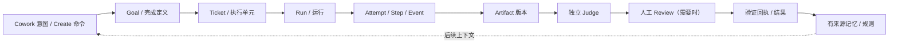

| 实现注释 | 规定 |
|---|---|
| 区域 | 意图入口、持久对象链、证据回链；每个节点可深链。 |
| 尺寸/响应式 | 桌面横向展示；移动端改为垂直步骤列表，节点不丢失。 |
| 主操作 | 从当前节点打开下游对象或证据检查器。 |
| 安全约束 | 对话状态不是事实源；副作用仅由持久事件、当前策略和回执确认。 |

## 2. 桌面 App Shell 几何

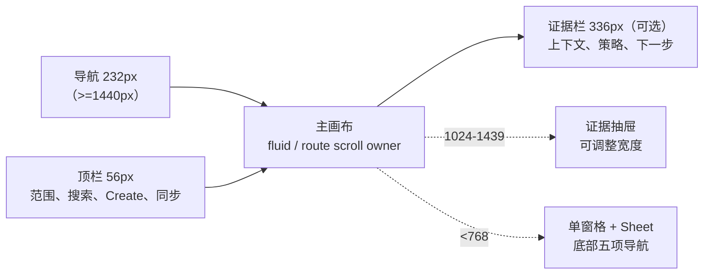

| 实现注释 | 规定 |
|---|---|
| 区域 | 固定导航、56px 顶栏、主画布、按路由启用的证据栏。 |
| 尺寸/响应式 | >=1440：232px + 336px rail；1024-1439：216px + 抽屉；768-1023：64px 图标栏；<768：单窗格。 |
| 主操作 | 顶栏 `Create` 或路由主按钮；跳过导航仍可到达标题。 |
| 安全约束 | 主内容只有一个滚动所有者；证据抽屉不遮住正在编辑的确认字段。 |

## 3. Mission Control 信息布局

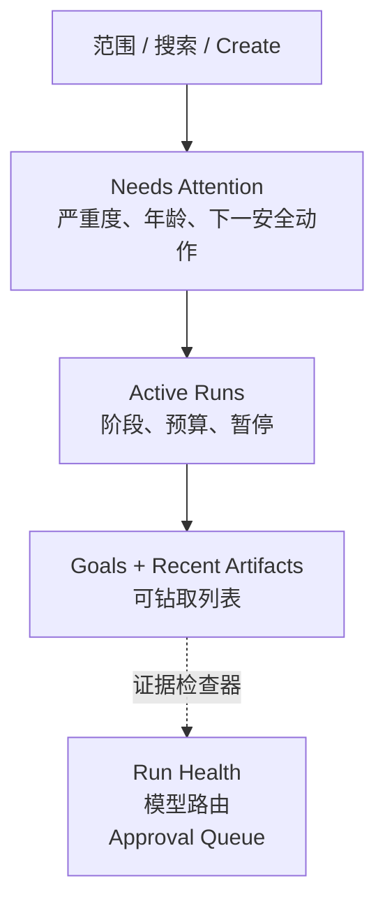

| 实现注释 | 规定 |
|---|---|
| 区域 | 顶部范围栏；关注项优先；运行中；目标/制品；右侧健康与批准。 |
| 尺寸/响应式 | 宽屏 12 列；窄桌面 rail 改抽屉；移动端按关注、运行、目标堆叠。 |
| 主操作 | 打开关注项、暂停获准运行、进入 Review 或创建工作。 |
| 安全约束 | 计数必须链接到明细；禁止无范围的“运行全部”；暂停需显示副作用影响。 |

## 4. Quick Cowork 到 Run

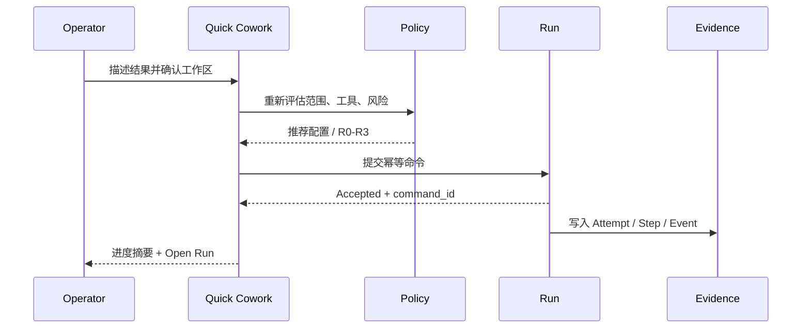

| 实现注释 | 规定 |
|---|---|
| 区域 | 对话时间线、配置芯片、命令提交、Run 深链、证据事件。 |
| 尺寸/响应式 | 桌面可开上下文抽屉；移动端保留 composer 与 Run 深链，复杂配置进 Sheet。 |
| 主操作 | `Start` 提交命令；状态先显示 Accepted/Queued，不伪装完成。 |
| 安全约束 | 服务端再次评估策略；确认不可扩大范围；幂等键在飞行中禁用重复提交。 |

## 5. Run Detail 布局

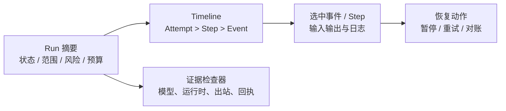

| 实现注释 | 规定 |
|---|---|
| 区域 | 摘要头、事件时间线、选中步骤面板、证据 rail、恢复区。 |
| 尺寸/响应式 | >=1440 并排；中等屏 rail 为抽屉；移动端先摘要后事件，日志为命名 reel。 |
| 主操作 | 打开事件证据；仅按策略允许暂停、恢复或重试。 |
| 安全约束 | `side_effect_unknown` 冻结重试并进入对账；事件游标恢复不重复计数。 |

## 6. Review Center / R3 决策与状态流

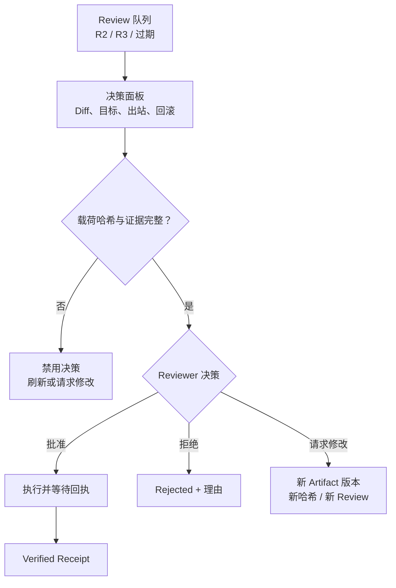

| 实现注释 | 规定 |
|---|---|
| 区域 | 队列、证据标签页、哈希/过期检查、决策按钮、回执。 |
| 尺寸/响应式 | 桌面可同时看 diff 与检查器；移动端仅证据摘要与深链，R3 不压缩成三列。 |
| 主操作 | 通过完整检查后批准、拒绝或请求修改。 |
| 安全约束 | R3 必须精确当前 hash、范围、出站、成本、期限和 Reviewer；Judge 不等于批准。 |

## 7. Artifact 与 Memory 关系

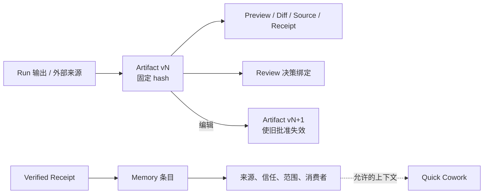

| 实现注释 | 规定 |
|---|---|
| 区域 | 制品版本头、渲染标签页、来源/回执、记忆来源与消费者。 |
| 尺寸/响应式 | 桌面支持 diff；移动端显示固定版本摘要，复杂 diff 转桌面。 |
| 主操作 | 打开版本、复制来源、从回执提议记忆或创建新版本。 |
| 安全约束 | 编辑始终产生新版本；记忆不能静默继承对话，敏感内容按范围脱敏。 |

## 8. Team / Workflow / Schedule

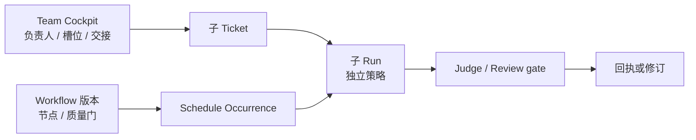

| 实现注释 | 规定 |
|---|---|
| 区域 | 团队槽位、任务交接、工作流版本、计划发生、运行历史。 |
| 尺寸/响应式 | 桌面可读图；平板显示有序 station 列表；移动端只看状态与发生记录。 |
| 主操作 | 分配子 Ticket、查看节点、暂停计划或打开某次 occurrence。 |
| 安全约束 | 负责人不继承全部权限；每个槽位单独策略；计划创建 durable occurrence，绝不重放旧对话。 |

## 9. 移动端五项 IA 与页面栈

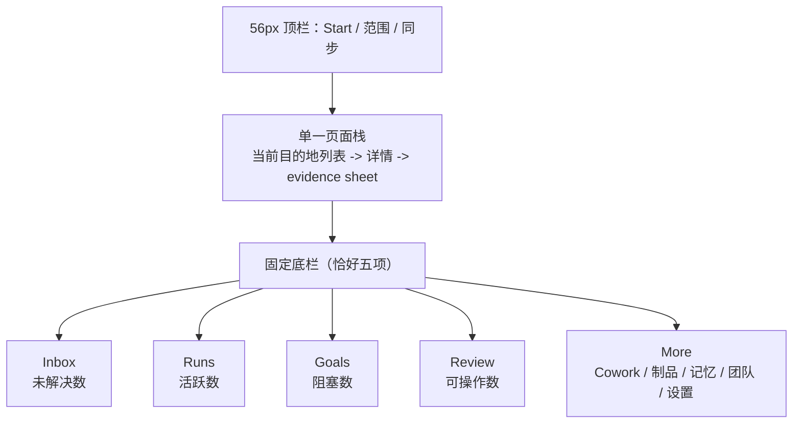

| 实现注释 | 规定 |
|---|---|
| 区域 | 56px 顶栏、一个主滚动窗格、详情路由或 action sheet、五项固定底栏。 |
| 尺寸/响应式 | <768px；触控目标至少 44x44px、间距至少 8px；主内容不水平溢出。 |
| 主操作 | 顶栏 `Start` 打开 Quick Cowork；从列表进入深链详情。 |
| 安全约束 | More 不新增底栏项；R3 仅在证据摘要完整时操作，复杂编辑显示“在桌面继续”。 |

## 10. 响应式断点转换

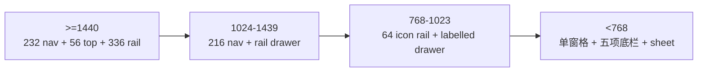

| 实现注释 | 规定 |
|---|---|
| 区域 | 导航、内容列、证据栏、交互入口的断点策略。 |
| 尺寸/响应式 | 使用 intrinsic grid；375px 主内容无横向滚动，代码/diff/图仅在命名 reel 内滚动。 |
| 主操作 | 每个断点保留同一主动作，改变承载方式（并排、抽屉、sheet）。 |
| 安全约束 | 断点切换不丢筛选、选中 tab、范围或未提交草稿；Back 恢复 URL 状态。 |

## 11. Route Map

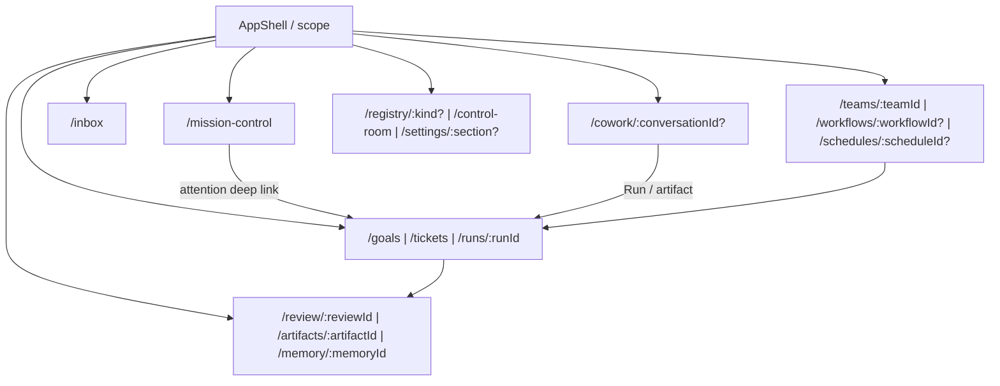

| 实现注释 | 规定 |
|---|---|
| 区域 | Shell 统一范围与权限；工作台、工作、证据、构建、系统路由分组。 |
| 尺寸/响应式 | 路由内容遵循 App Shell 断点；移动端 More 承载非核心目的地。 |
| 主操作 | 深链打开具体对象并保留 `workspace/site/project`、筛选、游标、tab。 |
| 安全约束 | URL 是可恢复视图状态，不是授权来源；每次变更仍在服务端校验。 |

## 12. 共享状态生命周期

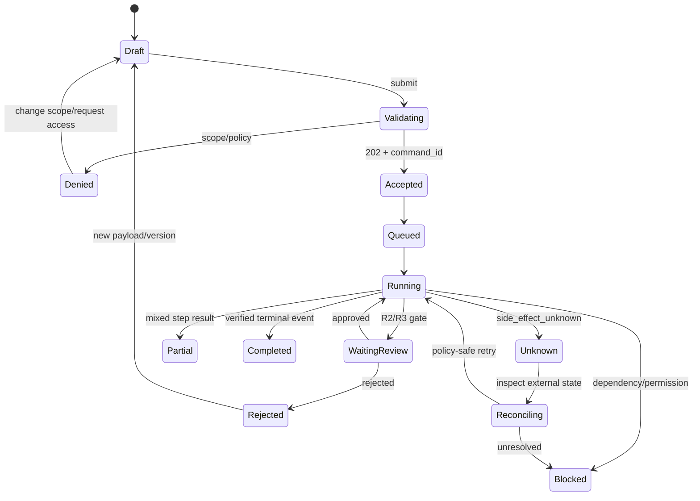

| 实现注释 | 规定 |
|---|---|
| 区域 | Draft、策略校验、命令接受、队列/运行、Review、终态与恢复。 |
| 尺寸/响应式 | 所有尺寸显示同一标签与图标；移动端以 StatePlane 卡片堆叠，状态不靠颜色单独表达。 |
| 主操作 | 用户只能触发当前状态允许的下一动作；完成须有验证终态事件。 |
| 安全约束 | 202/Accepted 不等于完成；离线不排队高风险批准；未知副作用先对账再重试。 |

## 实施检查清单

- [ ] 每个节点、行、计数均有范围、时间戳和证据深链。
- [ ] R3 决策面板在哈希、证据、期限、角色任一缺失时禁用批准。
- [ ] 375px、768px、1024px、1440px 验证滚动所有者、焦点顺序和五项移动导航。
- [ ] 所有状态同时提供可读标签、图标和下一安全动作；不得以颜色单独表达。
